# UNIX/Linux operating systems (Basic). 

1. [Установка ОС](#установка-ос)
2. [Создание нового пользователя](#создание-нового-пользователя)
3. [Настройка сети ОС](#настройка-сети-ос)
3. [Обновление ОС](#обновление-ос)

## Установка ОС
---
(Сами шаги предоврительной установки и настройки пропущены). <br>
Чтобы узнать версию установленой ОС требуется ввести в командную строку
``` bash
cat /etc/issue
```
> Версии могут отличаться.

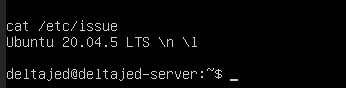

## Создание нового пользователя

Для того чтобы создать нового пользователя введите следующую команду. 
``` bash
sudo adduser -G adm user-1
cat /etc/passwd | grep user-1
```
Результат выполения команд. <br>
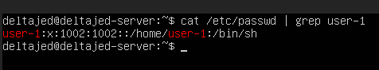

## Настройка сети ОС
1. Устанавливаем новое имя машины.
``` bash
hostnamectl set-hostname deltajed-server-1
```
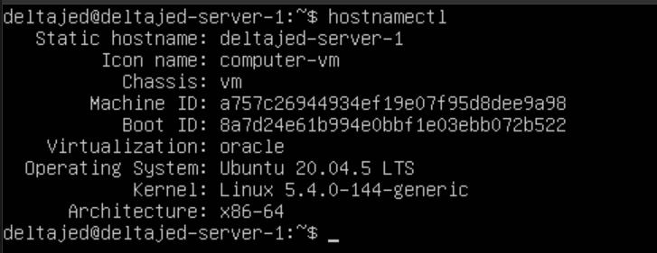

2. Устанавливаем временную зону, соответствующую вашему текущему местоположению.

``` bash
sudo timedatectl
timedatectl list-timezones | grep Tashkent
sudo timedatectl set-timezone Asia/Tashkent
sudo timedatectl
```

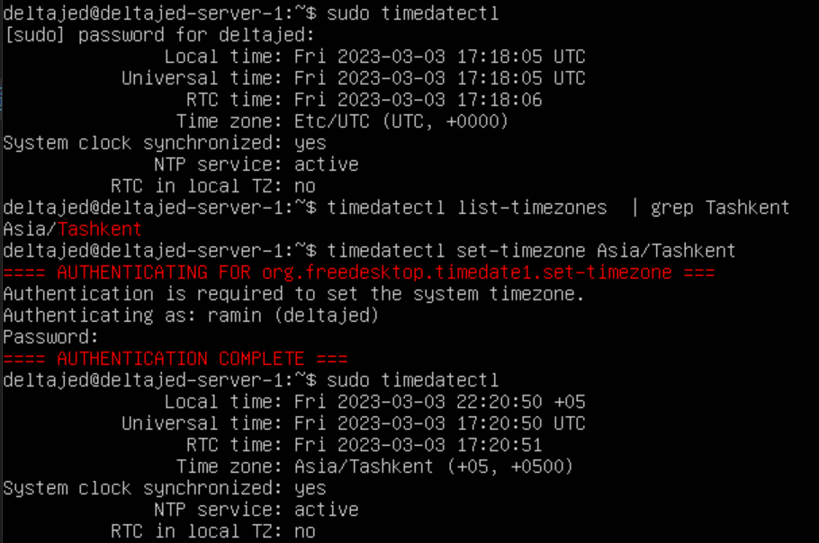

3. Вывести названия сетевых интерфейсов с помощью консольной команды.
Для этого надо установить набор сетевых инструментов.
``` bash
sudo apt install net-tools
```

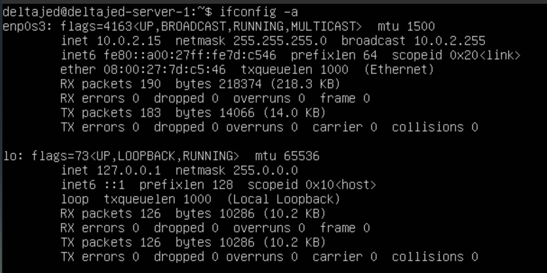

> `lo` или `local loopback` (локальная петля) – виртуальный интерфейс, присутствующий по умолчанию в любом Linux. Он используется для отладки сетевых программ и запуска серверных приложений на локальной машине. С этим интерфейсом всегда связан адрес 127.0.0.1. У него есть dns-имя – localhost.

4. Используя консольную команду получить ip адрес устройства, на котором вы работаете, от DHCP сервера.
``` bash 
hostname -I
```
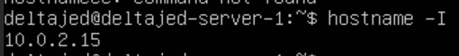

> Dynamic Host Configuration Protocol (DHCP) — автоматический предоставляет IP адреса и прочие настройки сети (маску сети, шлюз и т.п) компьютерам и различным устройствам в сети.

5. Определить и вывести на экран внешний ip-адрес шлюза (ip) и внутренний IP-адрес шлюза, он же ip-адрес по умолчанию (gw).

> Так мы можем определить наш внешний ip-адрес шлюза (ip):
``` bash
wget -O - -q icanhazip.com
curl ifconfig.me/ip
```
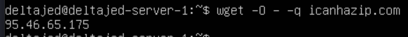

> Так мы можем определить наш внутренний IP-адрес шлюза:

``` bash 
ip route
```
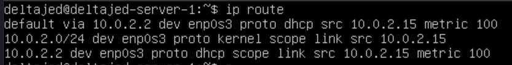

6. Задать статичные (заданные вручную, а не полученные от DHCP сервера) настройки ip, gw, dns (использовать публичный DNS серверы, например 1.1.1.1 или 8.8.8.8).

``` bash
sudo vim /etc/netplan/00-installer-config.yaml
```
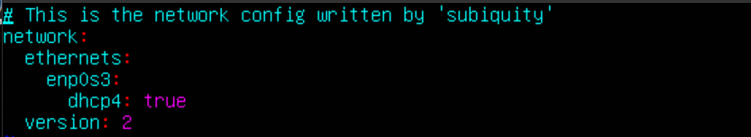
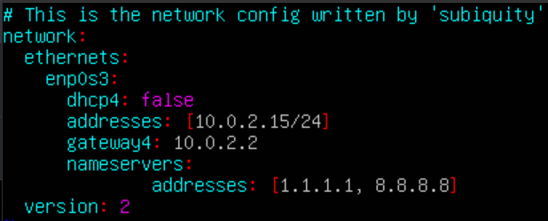

 > Изменили файл /etc/netplan/00-installer-config.yaml, применили изменения в netplan, перезагрузили машину.
``` bash
sudo netplan apply
reboot
```
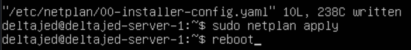

> Проверяем, что адреса соотсветствуют заданным в предыдущем пункте.
``` bash
ifconfig
```
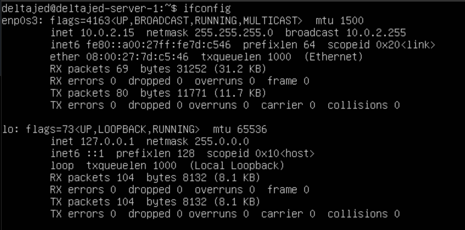

> Проверяем успешноли пропингуются удаленные хосты 1.1.1.1 и ya.ru
``` bash
ping 1.1.1.1
ping ya.ru
```
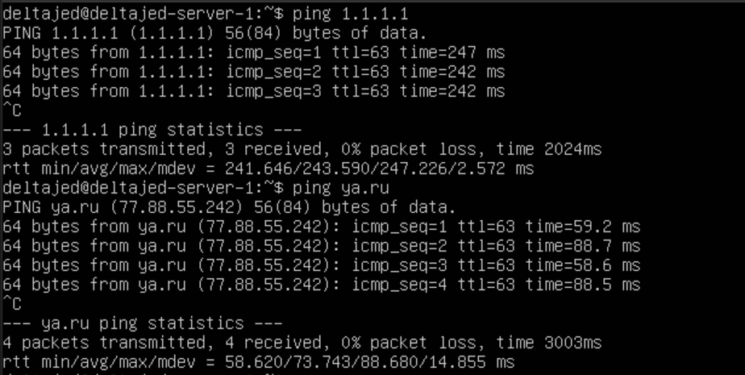

## Обновление ОС

> Обновить системные пакеты до последней на момент выполнения задания версии.

``` bash
sudo apt update
```

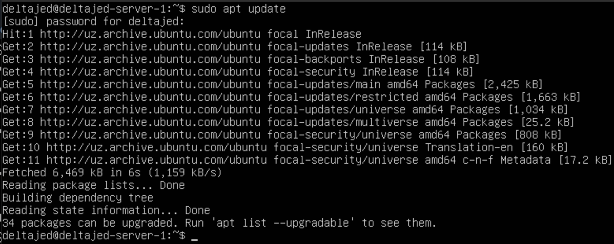