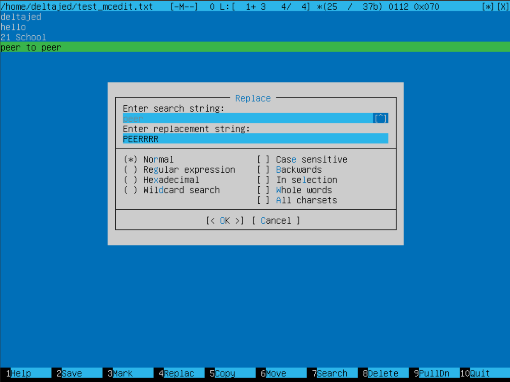

# UNIX/Linux operating systems (Basic). 

1. [Установка ОС](#установка-ос)
2. [Создание нового пользователя](#создание-нового-пользователя)
3. [Настройка сети ОС](#настройка-сети-ос)
4. [Обновление ОС](#обновление-ос)
5. [Использование команды sudo](#использование-команды-sudo)
6. [Установка и настройка службы времени](#установка-и-настройка-службы-времени)
7. [Установка и использование текстовых редакторов](#установка-и-использование-текстовых-редакторов)
    1. [VIM](#vim)
    2. [NANO](#nano)
    3. [MCEDIT](#mcedit)
8. []()

## Установка ОС
---
(Сами шаги предоврительной установки и настройки пропущены). <br>
Чтобы узнать версию установленой ОС требуется ввести в командную строку
``` bash
cat /etc/issue
```
> Версии могут отличаться.


## Создание нового пользователя

Для того чтобы создать нового пользователя введите следующую команду. 
``` bash
sudo adduser -G adm user-1
cat /etc/passwd | grep user-1
sudo passwd user-1
```
Результат выполения команд. <br>


## Настройка сети ОС
1. Устанавливаем новое имя машины.
``` bash
hostnamectl set-hostname deltajed-server-1
```


2. Устанавливаем временную зону, соответствующую вашему текущему местоположению.

``` bash
sudo timedatectl
timedatectl list-timezones | grep Tashkent
sudo timedatectl set-timezone Asia/Tashkent
sudo timedatectl
```


3. Вывести названия сетевых интерфейсов с помощью консольной команды.
Для этого надо установить набор сетевых инструментов.
``` bash
sudo apt install net-tools
```


> `lo` или `local loopback` (локальная петля) – виртуальный интерфейс, присутствующий по умолчанию в любом Linux. Он используется для отладки сетевых программ и запуска серверных приложений на локальной машине. С этим интерфейсом всегда связан адрес 127.0.0.1. У него есть dns-имя – localhost.

4. Используя консольную команду получить ip адрес устройства, на котором вы работаете, от DHCP сервера.
``` bash 
hostname -I
```


> Dynamic Host Configuration Protocol (DHCP) — автоматический предоставляет IP адреса и прочие настройки сети (маску сети, шлюз и т.п) компьютерам и различным устройствам в сети.

5. Определить и вывести на экран внешний ip-адрес шлюза (ip) и внутренний IP-адрес шлюза, он же ip-адрес по умолчанию (gw).

> Так мы можем определить наш внешний ip-адрес шлюза (ip):
``` bash
wget -O - -q icanhazip.com
curl ifconfig.me/ip
```


> Так мы можем определить наш внутренний IP-адрес шлюза:

``` bash 
ip route
```


6. Задать статичные (заданные вручную, а не полученные от DHCP сервера) настройки ip, gw, dns (использовать публичный DNS серверы, например 1.1.1.1 или 8.8.8.8).

``` bash
sudo vim /etc/netplan/00-installer-config.yaml
```


 > Изменили файл /etc/netplan/00-installer-config.yaml, применили изменения в netplan, перезагрузили машину.
``` bash
sudo netplan apply
reboot
```


> Проверяем, что адреса соотсветствуют заданным в предыдущем пункте.
``` bash
ifconfig
```


> Проверяем успешноли пропингуются удаленные хосты 1.1.1.1 и ya.ru
``` bash
ping 1.1.1.1
ping ya.ru
```


## Обновление ОС

> Обновить системные пакеты до последней на момент выполнения задания версии.

``` bash
sudo apt update
```


## Использование команды sudo
---
> Разрешить пользователю, созданному в [Part 2](#создание-нового-пользователя), выполнять команду sudo. <br>
`sudo` — это утилита, предоставляющая привилегии root для выполнения административных операций в соответствии со своими настройками. Она позволяет легко контролировать доступ к важным приложениям в системе. По умолчанию, при установке Ubuntu первому пользователю (тому, который создаётся во время установки) предоставляются полные права на использование sudo. Т.е. фактически первый пользователь обладает той же свободой действий, что и root.

``` bash
sudo usermod -a -G sudo user-1
su user-1
cat /etc/hostname
sudo hostname deltajed-server-2
su deltajed
```


## Установка и настройка службы времени

Чтобы настроить службу автоматической синхронизации времени.
``` bash
sudo timedatectl
timdatectl show
```


## Установка и использование текстовых редакторов
--- 
1. Установить текстовые редакторы VIM (+ любые два по желанию NANO, MCEDIT, JOE и т.д.)
``` bash 
sudo apt install vim
sudo apt install nano
sudo apt install mcedit
```
2. Используя каждый из трех выбранных редакторов, создайте файл `test_X.txt`, где `X` -- название редактора, в котором создан файл. Напишите в нём свой никнейм, закройте файл с сохранением изменений.
3. Используя каждый из трех выбранных редакторов, откройте файл на редактирование, отредактируйте файл, заменив никнейм на строку "21 School 21", закройте файл без сохранения изменений.
4. Используя каждый из трех выбранных редакторов, отредактируйте файл ещё раз (по аналогии с предыдущим пунктом), а затем освойте функции поиска по содержимому файла (слово) и замены слова на любое другое.

> Все файлы.
1. 

### VIM
> vim test_vim.txt \
> Режим редактирования `i` \
> Выйти из режима редактирования: `Esc` \
> Выход с сохранением: `:wq` \
> Выход без сохранения: `:q!`\
> Поиск: `/<Что хотим найти>` \
> Замена: `:s/<ЧТО>/<НА ЧТО>`

1. 

2. 

3. 

4. 

5. 

### NANO

> nano test_nano.txt \
> Выход с сохранением: `CTRL + X`, затем `Y` и `ENTER` \
> Выход без сохранения: `CTRL + X`, затем `N` \
> Поиск: `CTRL + W`, <Что ищем> затем `ENTER`. Для перехода к следующему совпадению `ALT + W`, для прекращения поиска `ALT + C` \
> Замена: `CTRL + \` + `<ЧТО + ENTER>` + `<НА ЧТО + ENTER>` - `A` - ALL || `Y` - YES || `N` - NO

1. 

2. 

3. 

4. 

5. 


### MCEDIT

> mcedit test_mcedit.txt \
> Выход с сохранением: `F2 <YES> + F10` \
> Выход без сохранения: `F10 <NO>` \
> Поиск: `F7` + <Что ищем> + `<OK> || <FIND ALL>` \
> Замена: `F4` + <ЧТО> + <НА ЧТО> + `<REPLACE> || <ALL> || <SKIP>`

1. 

2. 

3. 

4. 

5. 

6. 

7. 