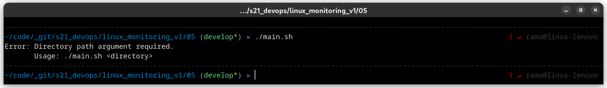

# Linux Monitoring v1.0

- [Linux Monitoring v1.0](#linux-monitoring-v10)
    - [1. Проба пера](#1-проба-пера)
  - [2. Исследование системы](#2-исследование-системы)
  - [3. Визуальное оформление вывода для скрипта исследования системы](#3-визуальное-оформление-вывода-для-скрипта-исследования-системы)
  - [4. Конфигурирование визуального оформления вывода для скрипта исследования системы](#4-конфигурирование-визуального-оформления-вывода-для-скрипта-исследования-системы)
  - [5. Исследование файловой системы](#5-исследование-файловой-системы)
  - [Task lists](#task-lists)

### 1. [Проба пера](#1-проба-пера)

> Перед тем, как приступать к помощи коллеге, Джон решил проверить свои знания на совсем небольшой программе.

**== Задание ==**

Написать bash-скрипт. Скрипт запускается с одним параметром. Параметр текстовый. <br>
Скрипт выводит значение параметра.<br>
Если параметр - число, то должно выводится сообщение о некорректности ввода.

Для запуска скрипта нужно, чтобы у файла были права на выполнение. Это можно сделать с помощью команды `chmod`.

Допустим, что скрипт находится в файле `main.sh` в текущей директории. Чтобы выдать права на выполнение скрипта, нужно выполнить следующую команду:

``` bash
chmod +x main.sh
```

Команда chmod изменяет права доступа к файлу. Символ `+` указывает на то, что нужно добавить права, а `x` означает право на выполнение. После этого команды `ls -l` должна отобразить права доступа, включающие `x` для файла `main.sh`.

После этого скрипт можно запустить, используя команду `./main.sh`, предварительно перейдя в директорию, где находится скрипт, если это необходимо.

``` bash
./main.sh
```

> Сам скрипт находится в папке `01`

```bash
#!/bin/bash

# Проверяем количество переданных параметров
if [ $# -ne 1 ]; then
    echo "Ошибка: скрипт принимает только один параметр."
    exit 1
fi

# Проверяем, что параметр не пустой
if [ -z "$1" ]; then
    echo "Ошибка: параметр не может быть пустым."
    exit 1
fi

# Проверяем, что параметр не является числом
if echo "$1" | grep -qE '^[A-Z]?+[a-z]?+[+-.,=]?[0-9]+[A-Z]?+[a-z]?+([+-.,=][0-9]+)?+[+-.,=]?+[A-Z]?+[a-z]?$'; then
    echo "Ошибка: параметр не может быть числом."
    exit 1
fi

# Проверяем, что параметр не содержит цифры
if [[ "$1" =~ [0-9] ]]; then
    echo "Ошибка: параметр содержит цифру."
    exit 1
fi

# Выводим значение параметра
echo "Параметр: $1"
```

<details>
  <summary>Тесты</summary>
  
1. Параметр является текстовой строкой:

``` bash
./main.sh "Hello World"
```

Результат:

``` bash
Параметр: Hello World
```

2. Параметр содержит цифру:

``` bash
./main.sh "Hello 123 World"
```

Результат:

``` bash
Ошибка: параметр содержит цифру.
```

3. Параметр является числом:

``` bash
./main.sh 123
```

Результат:

``` bash
Ошибка: параметр не может быть числом.
```

4. Параметр является числом:

``` bash
./main.sh ""
```

Результат:

``` bash
Ошибка: параметр не может быть пустым.
```

5. Параметр является числом:

``` bash
./main.sh "Hello" "World"
```

Результат:

``` bash
Ошибка: скрипт принимает только один параметр.
```

6. Параметр является числом:

``` bash
./main.sh "He2llo World"
```

Результат:

``` bash
Ошибка: параметр содержит цифру.
```

</details>

## 2. [Исследование системы](#2-исследование-системы)

**== Задание ==**

Написать bash-скрипт. Скрипт должен вывести на экран информацию в виде:<br>
`HOSTNAME` = сетевое имя <br>
`TIMEZONE` = временная зона в виде: America/New_York UTC -5 (временная зона, должна браться из системы и быть корректной для текущего местоположения) <br>
`USER` = текущий пользователь который запустил скрипт <br>
`OS` = тип и версия операционной системы <br>
`DATE` = текущее время в виде: 12 May 2020 12:24:36 <br>
`UPTIME` = время работы системы <br>
`UPTIME_SEC` = время работы системы в секундах <br>
`IP` = ip-адрес машины в любом из сетевых интерфейсов <br>
`MASK` = сетевая маска любого из сетевых интерфейсов в виде: xxx.xxx.xxx.xxx <br>
`GATEWAY` = ip шлюза по умолчанию <br>
`RAM_TOTAL` = размер оперативной памяти в Гб c точностью три знака после запятой в виде: 3.125 GB <br>
`RAM_USED` = размер используемой памяти в Гб c точностью три знака после запятой <br>
`RAM_FREE` = размер свободной памяти в Гб c точностью три знака после запятой <br>
`SPACE_ROOT` = размер рутового раздела в Mб с точностью два знака после запятой в виде: 254.25 MB <br>
`SPACE_ROOT_USED` = размер занятого пространства рутового раздела в Mб с точностью два знака после запятой <br>
`SPACE_ROOT_FREE` = размер свободного пространства рутового раздела в Mб с точностью два знака после запятой <br>

- После вывода значений предложить записать данные в файл (предложить пользователю ответить Y/N). Ответы `Y` и `y` считаются положительными, все прочие - отрицательными.
При согласии пользователя, в текущей директории создать файл содержащий информацию, которая была выведена на экран.
- Название файла должно иметь вид: `DD_MM_YY_HH_MM_SS.status` (Время в имени файла должно указывать момент сохранения данных).

> Сам скрипт находится в папке `02` \
> `main.sh`

``` bash
#!/bin/bash

# Импортируем функции из utils.sh
source ./utils.sh

# Вывод значений на экран
echo "HOSTNAME = $HOSTNAME"
echo "TIMEZONE = $(get_timezone)"
echo "USER = $USER"
echo "OS = $(get_os_name)"
echo "DATE = $DATE"
echo "UPTIME = $UPTIME"
echo "UPTIME_SEC = $UPTIME_SEC"
echo "IP = $(get_ip)"
echo "MASK = $(get_mask)"
echo "GATEWAY = $(get_gateway)"
echo "RAM_TOTAL = $(get_ram_gb)"
echo "RAM_USED = $(get_ram_used)"
echo "RAM_FREE = $(get_ram_free)"
echo "SPACE_ROOT = $(get_space_root)"
echo "SPACE_ROOT_USED = $(get_space_root_used)"
echo "SPACE_ROOT_FREE = $(get_space_root_free)"

# запрашиваем у пользователя, нужно ли записать данные в файл
read -p "Would you like to save this information to a file? (Y/N) " choice

# если пользователь согласен, сохраняем данные в файл
if [[ ${choice} =~ ^[Yy]$ ]]; then
  # формируем имя файла
  filename="$(date +'%d_%m_%y_%H_%M_%S').status"
  # записываем данные в файл
  {
    echo "HOSTNAME = $HOSTNAME"
    echo "TIMEZONE = $(get_timezone)"
    echo "USER = $USER"
    echo "OS = $(get_os_name)"
    echo "DATE = $DATE"
    echo "UPTIME = $UPTIME"
    echo "UPTIME_SEC = $UPTIME_SEC"
    echo "IP = $(get_ip)"
    echo "MASK = $(get_mask)"
    echo "GATEWAY = $(get_gateway)"
    echo "RAM_TOTAL = $(get_ram_gb)"
    echo "RAM_USED = $(get_ram_used)"
    echo "RAM_FREE = $(get_ram_free)"
    echo "SPACE_ROOT = $(get_space_root)"
    echo "SPACE_ROOT_USED = $(get_space_root_used)"
    echo "SPACE_ROOT_FREE = $(get_space_root_free)"
  } >"${filename}"
  echo "Information saved to file: ${filename}"
else
  echo "Information not saved to file"
fi
```

> `utils.sh`

``` bash
#!/bin/bash

# Получение сетевого имени
HOSTNAME=$(hostname)

# Получение текущиего пользователь который запустил скрипт
USER=$(whoami)

# Получение текущего время в виде: 12 May 2020 12:24:36
DATE=$(date +"%d %b %Y %T")

# Получение времени работы системы
UPTIME=$(uptime -p)

# Получение времени работы системы в секундах
UPTIME_SEC=$(awk '{print int($1)}' /proc/uptime)

# Функция для получения временной зона в виде: America/New_York UTC -5 
function get_timezone() {
  # local timezone=$(timedatectl | grep 'Time zone' | awk '{print $3, $4}' | sed 's/,\([^,]*\)$/)\1/')
  local timezone=$(timedatectl | grep "Time zone" | awk '{print $3}')
  if [ $(date +"%:z" | awk '{split($0,a,":"); print a[1]}' | cut -c2) == "0" ]; then
    timezone="$timezone UTC $(date +"%:z" | awk '{split($0,a,""); print a[1]""a[3]}')"
  else
    timezone="$timezone UTC $(date +"%:z" | awk '{split($0,a,":"); print a[1]}')"
  fi
  echo "${timezone}"
}

# Функция для получения имени ОС
function get_os_name() {
  if [ -f /etc/os-release ]; then
    # Используем /etc/os-release, если он есть
    source /etc/os-release
    echo $PRETTY_NAME
  elif [ -f /etc/redhat-release ]; then
    echo $(cat /etc/redhat-release)
  elif [ -f /etc/lsb-release ]; then
    # Используем /etc/lsb-release для Ubuntu
    source /etc/lsb-release
    echo $DISTRIB_DESCRIPTION
  else
    echo "Unknown"
  fi
}

# Функция для получения IP-адрес машины в любом из сетевых интерфейсов
function get_ip() {
  local ip=$(ip addr show | grep 'inet ' | grep -v '127.0.0.1' | awk '{print $2}' | cut -d/ -f1)
  echo "${ip}"
}

# Функция для получения ip шлюза по умолчанию
function get_gateway() {
  local gateway=$(ip route show default | awk '/default/{print $3}')
  echo "${gateway}"
}

# Функция для получения сетевой маски любого из сетевых интерфейсов в виде: xxx.xxx.xxx.xxx
function get_mask() {
  local mask=$(ifconfig | grep -w 'inet' | awk '{print $4}' | head -n 1)
  echo "${mask}"
}

# Функция для получения размера памяти в гигабайтах с точностью трем знакам после запятой
function get_ram_gb() {
  local ram_kb=$(grep -i 'memtotal' /proc/meminfo | awk '{print $2}')
  local ram_gb=$(echo "scale=3; $ram_kb/1024/1024" | bc)
  echo "$ram_gb GB"
}

# Функция для получения размера используемой памяти в гигабайтах с точностью трем знакам после запятой
function get_ram_used() {
  local ram_used=$(free | awk '/Mem:/ {printf("%.3f", $3/1024/1024);}')
  echo "${ram_used} GB"
}

# Функция для получения размера свободной памяти в гигабайтах с точностью трем знакам после запятой
function get_ram_free() {
  local ram_free=$(free | awk '/Mem:/ {printf("%.3f", $4/1024/1024);}')
  echo "${ram_free} GB"
}

# Функция для получения размера рутового раздела в мегабайтах с точностью двумя знаками после запятой
function get_space_root() {
  local space_root=$(df -BM / | awk 'NR==2{print $2}' | sed 's/M//')
  echo "${space_root} MB"
}

# Функция для получения размера занятого пространства на рутовом разделе в мегабайтах с точностью двумя знаками после запятой
function get_space_root_used() {
  local space_root_used=$(df -BM / | awk 'NR==2{print $3}' | sed 's/M//')
  echo "${space_root_used} MB"
}

# Функция для получения размера свободного пространства на рутовом разделе в мегабайтах с точностью двумя знаками после запятой
function get_space_root_free() {
  local space_root_free=$(df -BM / | awk 'NR==2{print $4}' | sed 's/M//')
  echo "${space_root_free} MB"
}
```

<details>
  <summary>Вывод</summary>
  HOSTNAME = linux-lenovo <br>
  TIMEZONE = Asia/Tashkent (+05) <br>
  USER = rama <br>
  OS = Manjaro Linux <br>
  DATE = 10 апр 2023 03:39:42 <br>
  UPTIME = up 11 hours, 22 minutes <br>
  UPTIME_SEC = 40962 <br>
  IP = 192.168.0.102 <br>
  172.17.0.1 <br>
  MASK = 255.255.0.0 <br>
  GATEWAY = 192.168.0.1 <br>
  RAM_TOTAL = 15.476 GB <br>
  RAM_USED = 6.183 GB <br>
  RAM_FREE = 3.575 GB <br>
  SPACE_ROOT = 97858 MB <br>
  SPACE_ROOT_USED = 80568 MB <br>
  SPACE_ROOT_FREE = 12274 MB <br>
  Would you like to save this information to a file? (Y/N) y <br>
  Information saved to file: 10_04_23_03_39_46.status
</details>

## 3. [Визуальное оформление вывода для скрипта исследования системы](#3-визуальное-оформление-вывода-для-скрипта-исследования-системы)

**== Задание ==**

Написать bash-скрипт.
За основу взять скрипт из [Исследование системы](#2-исследование-системы) и убрать из него часть, ответственную за сохранение данных в файл. Скрипт запускается с 4 параметрами.
> Параметры числовые. От 1 до 6, например: `main.sh 1 3 4 5` \
> Обозначения цветов: (1 - white, 2 - red, 3 - green, 4 - blue, 5 – purple, 6 - black)

- **Параметр 1** - это фон названий значений (HOSTNAME, TIMEZONE, USER и т.д.)
- **Параметр 2** - это цвет шрифта названий значений (HOSTNAME, TIMEZONE, USER и т.д.)
- **Параметр 3** - это фон значений (после знака '=')
- **Параметр 4** - это цвет шрифта значений (после знака '=')

1. Цвета шрифта и фона одного столбца не должны совпадать.
2. При вводе совпадающих значений должно выводится сообщение, описывающее проблему, и предложение повторно вызвать скрипт.
3. После вывода сообщения, программа должна корректно завершится.

> `main.sh`

```bash
#!/bin/bash

# Импортируем функции из utils.sh
source ./utils.sh

# Проверяем, все ли 4 параметра заданы
if [ $# -ne 4 ]; then
    echo "Usage: $0 <bg_color_val_names> <font_color_val_names> <bg_color_vals> <font_color_vals>"
    echo "       bg_color_val_names     - background color of labels (HOSTNAME, TIMEZONE, USER, etc.)"
    echo "       font_color_val_names   - foreground color of labels (HOSTNAME, TIMEZONE, USER, etc.)"
    echo "       bg_color_vals          - background color of values"
    echo "       font_color_vals        - foreground color of values"
    echo "       Available colors:"
    echo "       1 - white"
    echo "       2 - red"
    echo "       3 - green"
    echo "       4 - blue"
    echo "       5 - purple"
    echo "       6 - black"
    exit 1
fi

# Проверяем, все ли параметры являются числовыми и находятся в пределах диапазона [1..6]
for i in {1..4}; do
    if ! [[ ${!i} =~ ^[1-6]$ ]]; then
        echo "Error: Parameter color must be a number between 1 and 6."
        echo "       Available colors:"
        echo "       1 - white"
        echo "       2 - red"
        echo "       3 - green"
        echo "       4 - blue"
        echo "       5 - purple"
        echo "       6 - black"
        exit 1
    fi
done

# Проверьяем, отличаются ли цвет шрифта и фона имен значений
if [ "${1}" = "${2}" ] || [ "${3}" = "${4}" ]; then
    echo "Error: Font and background colors of one column must not match. Please try again."
    read -p "Do you want to run the script again with different parameters? (Y/N) " choice
    if [[ ${choice} =~ ^[Yy]$ ]]; then
        echo "Usage: $0 <bg_color_val_names> <font_color_val_names> <bg_color_vals> <font_color_vals>"
        exit 1
    else
        exit 1
    fi
fi

# Цветовая палитра
bg_color_val_names=('47' '41' '42' '44' '45' '40')
font_color_val_names=('97' '91' '92' '94' '95' '90')
bg_color_vals=('47' '41' '42' '44' '45' '40')
font_color_vals=('97' '91' '92' '94' '95' '90')

# Устанавливаем цветовые коды на основе параметров
bg_val_names=${bg_color_val_names[$1 - 1]}
font_val_names=${font_color_val_names[$2 - 1]}
bg_vals=${bg_color_vals[$3 - 1]}
font_vals=${font_color_vals[$4 - 1]}

# Вывод значений на экран с цветами
printf "\e[${bg_val_names};${font_val_names}mHOSTNAME = \e[0m\e[${bg_vals};${font_vals}m%s\e[0m\n" "$HOSTNAME"
printf "\e[${bg_val_names};${font_val_names}mTIMEZONE = \e[0m\e[${bg_vals};${font_vals}m%s\e[0m\n" "$(get_timezone)"
printf "\e[${bg_val_names};${font_val_names}mUSER = \e[0m\e[${bg_vals};${font_vals}m%s\e[0m\n" "$USER"
printf "\e[${bg_val_names};${font_val_names}mOS = \e[0m\e[${bg_vals};${font_vals}m%s\e[0m\n" "$(get_os_name)"
printf "\e[${bg_val_names};${font_val_names}mDATE = \e[0m\e[${bg_vals};${font_vals}m%s\e[0m\n" "$DATE"
printf "\e[${bg_val_names};${font_val_names}mUPTIME = \e[0m\e[${bg_vals};${font_vals}m%s\e[0m\n" "$UPTIME"
printf "\e[${bg_val_names};${font_val_names}mUPTIME_SEC = \e[0m\e[${bg_vals};${font_vals}m%s\e[0m\n" "$UPTIME_SEC"
printf "\e[${bg_val_names};${font_val_names}mIP = \e[0m\e[${bg_vals};${font_vals}m%s\e[0m\n" "$(get_ip)"
printf "\e[${bg_val_names};${font_val_names}mMASK = \e[0m\e[${bg_vals};${font_vals}m%s\e[0m\n" "$(get_mask)"
printf "\e[${bg_val_names};${font_val_names}mGATEWAY = \e[0m\e[${bg_vals};${font_vals}m%s\e[0m\n" "$(get_gateway)"
printf "\e[${bg_val_names};${font_val_names}mRAM_TOTAL = \e[0m\e[${bg_vals};${font_vals}m%s\e[0m\n" "$(get_ram_gb)"
printf "\e[${bg_val_names};${font_val_names}mRAM_USED = \e[0m\e[${bg_vals};${font_vals}m%s\e[0m\n" "$(get_ram_used)"
printf "\e[${bg_val_names};${font_val_names}mRAM_FREE= \e[0m\e[${bg_vals};${font_vals}m%s\e[0m\n" "$(get_ram_free)"
printf "\e[${bg_val_names};${font_val_names}mSPACE_ROOT = \e[0m\e[${bg_vals};${font_vals}m%s\e[0m\n" "$(get_space_root)"
printf "\e[${bg_val_names};${font_val_names}mSPACE_ROOT_USED = \e[0m\e[${bg_vals};${font_vals}m%s\e[0m\n" "$(get_space_root_used)"
printf "\e[${bg_val_names};${font_val_names}mSPACE_ROOT_FREE = \e[0m\e[${bg_vals};${font_vals}m%s\e[0m\n" "$(get_space_root_free)"

exit 0
```

> Логика bash-скрипта `utils.sh` не изменилася из [Исследование системы](#2-исследование-системы)

Примеры вывода:

1. Корректный ввод `./main.sh 1 2 6 5`

2. Корректный ввод `./main.sh 3 4 1 5`

3. Ввод без параметров

4. Ввод с параметром, который не входит в диапазон значений


## 4. [Конфигурирование визуального оформления вывода для скрипта исследования системы](#4-конфигурирование-визуального-оформления-вывода-для-скрипта-исследования-системы)

**== Задание ==**

Написать bash-скрипт. За основу берется скрипт из [визуальное оформление вывода для скрипта исследования системы](#3-визуальное-оформление-вывода-для-скрипта-исследования-системы). Обозначения цветов аналогичные. Скрипт запускается без параметров.
Параметры задаются в конфигурационном файле до запуска скрипта.

- Конфигурационный файл должен иметь вид:

> `config.cfg`

``` yaml
column1_background=2
column1_font_color=4
column2_background=5
column2_font_color=1
```

Если один или несколько параметров не заданы в конфигурационном файле, то цвет должен подставляться из цветовой схемы, заданной по умолчанию. ***(Выбор на усмотрение разработчика)***.
После вывода информации о системе из [визуальное оформление вывода для скрипта исследования системы](#3-визуальное-оформление-вывода-для-скрипта-исследования-системы), нужно, сделав отступ в одну пустую строку, вывести цветовую схему в следующем виде:

``` yaml
Column 1 background = 2 (red)
Column 1 font color = 4 (blue)
Column 2 background = 5 (purple)
Column 2 font color = 1 (white)
```

При запуске скрипта с цветовой схемой по умолчанию вывод должен иметь вид:

``` yaml
Column 1 background = default (black)
Column 1 font color = default (white)
Column 2 background = default (red)
Column 2 font color = default (blue)
```

> `main.sh`

``` bash
#!/bin/bash

# Импортируем функции из utils.sh
source ./utils.sh

# Проверяем, существует ли файл конфигурации
if [[ ! -f ./config.cfg ]]; then
    echo "Error: Config file not found!"
    exit 1
fi

# Цветовая схема по умолчанию
default_bg_colors=("2" "1")
default_font_colors=("1" "2")

# Цветовая схема
bg_color_val_names=('47' '41' '42' '44' '45' '40')
font_color_val_names=('97' '91' '92' '94' '95' '90')
bg_color_vals=('47' '41' '42' '44' '45' '40')
font_color_vals=('97' '91' '92' '94' '95' '90')
color_names=("white" "red" "green" "blue" "purple" "black")

# Загружаем значение из конфигурации или используем значения по умолчанию, если они не определены
column1_background=$(grep "^column1_background=" config.cfg | cut -d "=" -f 2)
if [[ -z "$column1_background" ]]; then
    column1_background=${default_bg_colors[0]}
    default_column1_background="default ("${color_names[$column1_background - 1]}")"
fi

column1_font_color=$(grep "^column1_font_color=" config.cfg | cut -d "=" -f 2)
if [[ -z "$column1_font_color" ]]; then
    column1_font_color=${default_font_colors[0]}
    default_column1_font_color="default ("${color_names[$column1_font_color - 1]}")"
fi

column2_background=$(grep "^column2_background=" config.cfg | cut -d "=" -f 2)
if [[ -z "$column2_background" ]]; then
    column2_background=${default_bg_colors[1]}
    default_column2_background="default ("${color_names[$column2_background - 1]}")"
fi
column2_font_color=$(grep "^column2_font_color=" config.cfg | cut -d "=" -f 2)
if [[ -z "$column2_font_color" ]]; then
    column2_font_color=${default_font_colors[1]}
    default_column2_font_color="default ("${color_names[$column2_font_color - 1]}")"
fi

# Проверьяем, отличаются ли цвет шрифта и фона имен значений
if [ "$column1_background" = "$column1_font_color" ] || [ "$column2_background" = "$column2_font_color" ]; then
    echo "Error: Font and background colors of one column must not match. Please try again."
    exit 1
fi

# Проверяем, все ли параметры являются числовыми и находятся в пределах диапазона [1..6]
if ! [[ $column1_background =~ ^[1-6]$ ]] ||
    ! [[ $column1_font_color =~ ^[1-6]$ ]] ||
    ! [[ $column2_background =~ ^[1-6]$ ]] ||
    ! [[ $column2_font_color =~ ^[1-6]$ ]]; then
    echo "Error: Parameter color must be a number between 1 and 6."
    echo "       Available colors:"
    echo "       1 - white"
    echo "       2 - red"
    echo "       3 - green"
    echo "       4 - blue"
    echo "       5 - purple"
    echo "       6 - black"
    exit 1
fi

# Устанавливаем цветовые коды на основе параметров
bg_val_names=${bg_color_val_names[$column1_background - 1]}
font_val_names=${font_color_val_names[$column1_font_color - 1]}
bg_vals=${bg_color_vals[$column2_background - 1]}
font_vals=${font_color_vals[$column2_font_color - 1]}

# Вывод информации о системе с цветовой схемой
printf "\e[${bg_val_names};${font_val_names}mHOSTNAME = \e[0m\e[${bg_vals};${font_vals}m%s\e[0m\n" "$HOSTNAME"
printf "\e[${bg_val_names};${font_val_names}mTIMEZONE = \e[0m\e[${bg_vals};${font_vals}m%s\e[0m\n" "$(get_timezone)"
printf "\e[${bg_val_names};${font_val_names}mUSER = \e[0m\e[${bg_vals};${font_vals}m%s\e[0m\n" "$USER"
printf "\e[${bg_val_names};${font_val_names}mOS = \e[0m\e[${bg_vals};${font_vals}m%s\e[0m\n" "$(get_os_name)"
printf "\e[${bg_val_names};${font_val_names}mDATE = \e[0m\e[${bg_vals};${font_vals}m%s\e[0m\n" "$DATE"
printf "\e[${bg_val_names};${font_val_names}mUPTIME = \e[0m\e[${bg_vals};${font_vals}m%s\e[0m\n" "$UPTIME"
printf "\e[${bg_val_names};${font_val_names}mUPTIME_SEC = \e[0m\e[${bg_vals};${font_vals}m%s\e[0m\n" "$UPTIME_SEC"
printf "\e[${bg_val_names};${font_val_names}mIP = \e[0m\e[${bg_vals};${font_vals}m%s\e[0m\n" "$(get_ip)"
printf "\e[${bg_val_names};${font_val_names}mMASK = \e[0m\e[${bg_vals};${font_vals}m%s\e[0m\n" "$(get_mask)"
printf "\e[${bg_val_names};${font_val_names}mGATEWAY = \e[0m\e[${bg_vals};${font_vals}m%s\e[0m\n" "$(get_gateway)"
printf "\e[${bg_val_names};${font_val_names}mRAM_TOTAL = \e[0m\e[${bg_vals};${font_vals}m%s\e[0m\n" "$(get_ram_gb)"
printf "\e[${bg_val_names};${font_val_names}mRAM_USED = \e[0m\e[${bg_vals};${font_vals}m%s\e[0m\n" "$(get_ram_used)"
printf "\e[${bg_val_names};${font_val_names}mRAM_FREE= \e[0m\e[${bg_vals};${font_vals}m%s\e[0m\n" "$(get_ram_free)"
printf "\e[${bg_val_names};${font_val_names}mSPACE_ROOT = \e[0m\e[${bg_vals};${font_vals}m%s\e[0m\n" "$(get_space_root)"
printf "\e[${bg_val_names};${font_val_names}mSPACE_ROOT_USED = \e[0m\e[${bg_vals};${font_vals}m%s\e[0m\n" "$(get_space_root_used)"
printf "\e[${bg_val_names};${font_val_names}mSPACE_ROOT_FREE = \e[0m\e[${bg_vals};${font_vals}m%s\e[0m\n\n" "$(get_space_root_free)"

# Вывод информации по выброной цветовой схеме
if [[ -z "$default_column1_background" ]]; then
    printf "Column 1 background = $column1_background (${color_names[$column1_background - 1]})\n"
else
    printf "Column 1 background = $default_column1_background\n"
fi

if [[ -z "$default_column1_font_color" ]]; then
    printf "Column 1 font color = $column1_font_color (${color_names[$column1_font_color - 1]})\n"
else
    printf "Column 1 font color = $default_column1_font_color\n"
fi

if [[ -z "$default_column2_background" ]]; then
    printf "Column 2 background = $column2_background (${color_names[$column2_background - 1]})\n"
else
    printf "Column 2 background = $default_column2_background\n"
fi

if [[ -z "$default_column2_font_color" ]]; then
    printf "Column 2 font color = $column2_font_color (${color_names[$column2_font_color - 1]})\n"
else
    printf "Column 2 font color = $default_column2_font_color\n"
fi

exit 0
```

> Логика bash-скрипта `utils.sh` не изменилася из [Исследование системы](#2-исследование-системы)

Примеры вывода:

1. Корректный ввод из файла с конфигурацией `./config.cfg`

2. Отоброжение из стандартного пресета `./main.sh`

3. Часть палитры из из файла с конфигурацией `./config.cfg` другая по умолчанию `./main.sh`

4. Ввод с параметром, который не входит в диапазон значений

5. Некорректный ввод фон и цвет текста совпадают


## 5. [Исследование файловой системы](#5-исследование-файловой-системы)

 **== Задание ==**

Написать bash-скрипт. Скрипт запускается с одним параметром.
Параметр - это абсолютный или относительный путь до какой-либо директории. Параметр должен заканчиваться знаком '/', например: `main.sh /var/log/`

Скрипт должен выводить следующую информацию о каталоге, указанном в параметре:

- Общее число папок, включая вложенные
- Топ 5 папок с самым большим весом в порядке убывания (путь и размер)
- Общее число файлов
- Число конфигурационных файлов (с расширением .conf), текстовых файлов, исполняемых файлов, логов (файлов с расширением .log), архивов, символических ссылок
- Топ 10 файлов с самым большим весом в порядке убывания (путь, размер и тип)
- Топ 10 исполняемых файлов с самым большим весом в порядке убывания (путь, размер и хеш)
- Время выполнения скрипта

Скрипт должен вывести на экран информацию в виде:

```shell
Total number of folders (including all nested ones) = 6  
TOP 5 folders of maximum size arranged in descending order (path and size):  
1 - /var/log/one/, 100 GB  
2 - /var/log/two/, 100 MB  
etc up to 5
Total number of files = 30
Number of:  
Configuration files (with the .conf extension) = 1 
Text files = 10  
Executable files = 5
Log files (with the extension .log) = 2  
Archive files = 3  
Symbolic links = 4  
TOP 10 files of maximum size arranged in descending order (path, size and type):  
1 - /var/log/one/one.exe, 10 GB, exe  
2 - /var/log/two/two.log, 10 MB, log  
etc up to 10  
TOP 10 executable files of the maximum size arranged in descending order (path, size and MD5 hash of file)  
1 - /var/log/one/one.exe, 10 GB, 3abb17b66815bc7946cefe727737d295  
2 - /var/log/two/two.exe, 9 MB, 53c8fdfcbb60cf8e1a1ee90601cc8fe2  
etc up to 10  
Script execution time (in seconds) = 1.5
```

> `main.sh`

``` bash
#!/bin/bash

#  Начало таймера
start_time=$(date +%s.%N)

# Проверяем, предоставил ли пользователь аргумент пути
if [ $# -eq 0 ]; then
    echo "Error: Directory path argument required."
    echo "       Usage: $0 <directory>"
    exit 1
fi

dir_path=$1

# Проверяем, закрыл ли пользователь путь "/"
if [ "${dir_path: -1}" != "/" ]; then
    echo "The directory path must end with '/'"
    exit 1
fi

# Проверяем, является ли предоставленный аргумент каталогом
if [ ! -d "$dir_path" ]; then
    echo "Error: '$dir_path' the specified directory does not exist."
    exit 1
fi

# Общее количество папок (включая все вложенные)
total_folders=$(find "$dir_path" -type d | wc -l)

# Топ-5 папок максимального размера, расположенных в порядке убывания (путь и размер)
top_folders=$(du -h "$dir_path"* | sort -hr | head -n 5 | awk '{print NR " - " $2 ", " $1}')

# Общее количество файлов
total_files=$(find "$dir_path" -type f | wc -l)

# Количество конфигурационных файлов (с расширением .conf), текстовых файлов, исполняемых файлов, файлов журнала (файлы с расширением .log), архивов, символических ссылок
conf_files=$(find "$dir_path" -type f -name "*.conf" | wc -l)
txt_files=$(find "$dir_path" -type f -name "*.txt" | wc -l)
exe_files=$(find "$dir_path" -type f -executable | wc -l)
log_files=$(find "$dir_path" -type f -name "*.log" | wc -l)
archive_files=$(find "$dir_path" -type f \( -name "*.zip" -o -name "*.7z" -o -name "*.tar" -o -name "*.rar" -o -name "*.gz" \) | wc -l)
symlinks=$(find "$dir_path" -type l | wc -l)

# Топ 10 файлов с самым большим весом в порядке убывания (путь, размер и тип)
largest_files="$(find "$dir_path" -type f -exec du -h {} + | sort -hr | sed -n '1,10'p | awk '{printf("%d - %s, %s, ", NR, $2, $1); system("bash -c '\''file -b --mime-type "$2"'\''")}')"

# Топ 10 исполняемых файлов с самым большим весом в порядке убывания (путь, размер и хеш)
largest_executable_files=$(find "$dir_path" -type f -executable -exec du -h {} +| sort -hr | head -n 10 | awk '{printf "%d - %s, %s, ", NR, $2, $1; system("md5sum " $2 " | cut -d\" \" -f1")}')

# Вывод на экран
echo "Total number of folders (including all nested ones) = $total_folders"
echo "TOP 5 folders of maximum size arranged in descending order (path and size):"
echo "$top_folders"
echo "Total number of files = $total_files"
echo "Number of:"
echo "Configuration files (with the .conf extension) = $conf_files"
echo "Text files = $txt_files"
echo "Executable files = $exe_files"
echo "Log files (with the extension .log) = $log_files"
echo "Archive files = $archive_files"
echo "Symbolic links = $symlinks"
echo "TOP 10 files of maximum size arranged in descending order (path, size and type):"
echo "$largest_files"
echo "TOP 10 executable files of the maximum size arranged in descending order (path, size and MD5 hash of file):"
echo "$largest_executable_files"

# Завершение таймера и рассчет время выполнения
end_time=$(date +%s.%N)
elapsed_time=$(echo "$end_time - $start_time" | bc -l)
echo "Script execution time (in seconds) = $elapsed_time"
```

Примеры вывода:

1. Корректный путь к каталогу 

2. Некорректный путь без '/'

3. Запуск без параметров

4. Отсутвует каталог


## Task lists

- [x] First effort
- [x] System research
- [x] Visual output design for the system research script
- [x] Configuring visual output design for the system research script.
- [x] File system research
