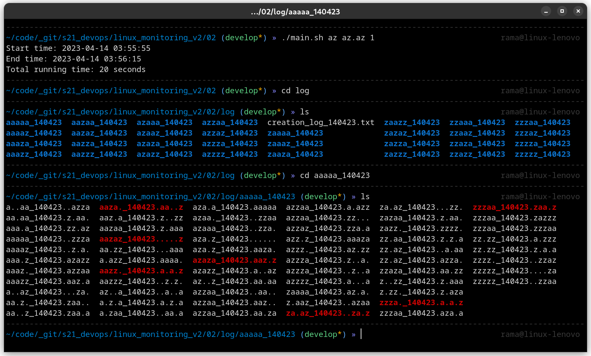
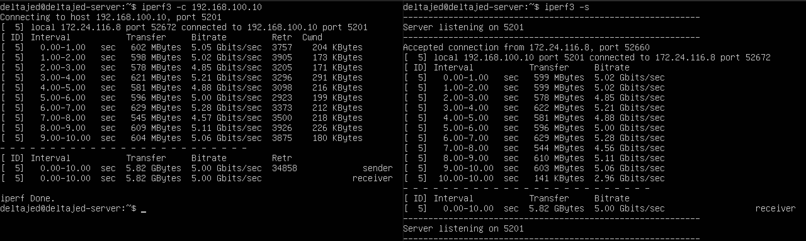

# Linux Monitoring v2.0

Мониторинг и исследование состояния системы в реальном времени.

- Для каждого задания должна быть создана папка с названием вида: `0x`, где x - номер задания
- Все скрипты должны быть декомпозированы и разбиты на несколько файлов
- Файл с основным сценарием для каждого задания должен называться `main.sh`
- Во всех скриптах должны быть предусмотрены проверки на некорректный ввод (указаны не все параметры, параметры неправильного формата и т.д.)
- Все написанные скрипты были проверены на машине с *`Manjaro Linux`*

## Содержание

1. [Linux Monitoring v2.0](#linux-monitoring-v20) \
    1.1. [Генератор файлов](#1-генератор-файлов) \
    1.2. [Засорение файловой системы](#2-засорение-файловой-системы) \
    1.3. [Очистка файловой системы](#3-очистка-файловой-системы) \
    1.4. [Генератор логов](#4-генератор-логов) \
    1.5. [Мониторинг](#5-мониторинг) \
    1.6. [GoAccess](#6-goaccess) \
    1.7. [Prometheus и Grafana](#7-prometheus-и-grafana) \
    1.8. [Готовый дашборд](#8-готовый-дашборд) \
    1.9. [Дополнительно. Свой node_exporter](#9-дополнительно-свой-node_exporter)
2. [Task lists](#task-lists)

## 1. Генератор файлов

**== Задание ==**

Написать bash-скрипт. Скрипт запускается с 6 параметрами.
Пример запуска скрипта: `main.sh /opt/test 4 az 5 az.az 3kb`

- **Параметр 1** - это абсолютный путь
- **Параметр 2** - количество вложенных папок
- **Параметр 3** - список букв английского алфавита, используемый в названии папок (не более 7 знаков)
- **Параметр 4** - количество файлов в каждой созданной папке
- **Параметр 5** - список букв английского алфавита, используемый в имени файла и расширении (не более 7 знаков для имени, не более 3 знаков для расширения)
- **Параметр 6** - размер файлов (в килобайтах, но не более 100)

Имена папок и файлов должны состоять только из букв, указанных в параметрах, и использовать каждую из них хотя бы 1 раз.

Длина этой части имени должна быть от 4 знаков, плюс дата запуска скрипта в формате DDMMYY, отделённая нижним подчёркиванием, например: `./aaaz_021121/, ./aaazzzz_021121`

При этом, если для имени папок или файлов были заданы символы `az`, то в названии файлов или папок не может быть обратной записи: `./zaaa_021121/`, т.е. порядок указанных символов в параметре должен сохраняться.

При запуске скрипта в указанном в параметре 1 месте, должны быть созданы папки и файлы в них с соответствующими именами и размером.

Скрипт должен остановить работу, если в файловой системе (в разделе `/`) останется 1 Гб свободного места.

Записать лог файл с данными по всем созданным папкам и файлам (полный путь, дата создания, размер для файлов).

> `main.sh`

``` bash
#!/bin/bash

# Set the script start time
start_time=$(date +%s.%N)

function generate_name() {
    local chars="$1"
    local min_length=4
    local name=""
    
    for ((i=0; i<$min_length; i++)); do
        name="${name}${chars:$((RANDOM % ${#chars})):1}"
    done
    
    echo "${name}"
}

# Check if there is enough space to create files
function check_space() {
    local available_space=$(df --output=avail / | tail -1)
    local min_space=$((1024 * 1024))
    
    if [[ $available_space -lt $min_space ]]; then
        echo "Error: Not enough space to create files. Aborting."
        exit 1
    fi
}

# Define function to create folder and files with specified names and size
function create_folders_and_files() {
    local base_path="$1"
    local num_folders="$2"
    local folder_chars="$3"
    local num_files="$4"
    local file_chars="$5"
    local ext_chars="${file_chars:0:3}"
    local file_size_kb="$6"
    local log_file="$7"
    local date_suffix=$(date '+%d%m%y')
    
    # Create subfolders with names that include specified characters
    for ((i=0; i<$num_folders; i++)); do
        check_space
        
        local folder_name="$(generate_name "$folder_chars")_${date_suffix}"
        local folder_path="${base_path}/${folder_name}"
        mkdir -p "$folder_path"
        
        # Create files with names that include specified characters and specified size
        for ((j=0; j<$num_files; j++)); do
            check_space
            
            local file_name="$(generate_name "$file_chars")_${date_suffix}"
            local file_ext="$(generate_name "$ext_chars")"
            local file_path="${folder_path}/${file_name}.${file_ext}"
            
            truncate -s "${file_size_kb}K" "$file_path"
            echo "$(date '+%Y-%m-%d %H:%M:%S') | Created: ${file_path} | Size: ${file_size_kb}K" >> "$log_file"
        done
    done
}

function main() {
    if [[ $# -ne 6 ]]; then
        echo "Error: Arguments required."
        echo "      Usage: $0 <absolute_path> <num_folders> <folder_chars> <num_files> <file_chars> <file_size_kb>"
        exit 1
    fi
    
    # Assign input parameters to variables
    local base_path="$1"
    local num_folders="$2"
    local folder_chars="$3"
    local num_files="$4"
    local file_chars="$5"
    local file_size_kb="$6"
    
    
    if ! [[ $num_folders =~ ^[0-9]+$ ]] || ! [[ $num_files =~ ^[0-9]+$ ]] || ! [[ $file_size_kb =~ ^[0-9]+$ ]]; then
        echo "Error: One of the arguments is not a number."
        echo "      Usage: $0 <absolute_path> <num_folders> <folder_chars> <num_files> <file_chars> <file_size_kb>"
        
        exit 1
    fi
    
    if [[ $file_size_kb -gt 100 ]]; then
        echo "Error: File size should not exceed 100KB."
        exit 1
    fi
    
    local log_file="${base_path}/creation_log_$(date '+%d%m%y').txt"
    create_folders_and_files "$base_path" "$num_folders" "$folder_chars" "$num_files" "$file_chars" "$file_size_kb" "$log_file"
}

main "$@"

# Calculate script execution time
end_time=$(date +%s.%N)
elapsed_time=$(echo "$end_time - $start_time" | bc)
echo "Script execution time (in seconds) = $elapsed_time"
```

> Пример создаваемого лог файла *`creation_log_DDMMYY.txt`*

``` text
2023-04-14 03:09:02 | Created: log/zdzd_140423/dq.d_140423...dd | Size: 50K
2023-04-14 03:09:02 | Created: log/zdzd_140423/dq.q_140423.ddd. | Size: 50K
2023-04-14 03:09:02 | Created: log/zdzd_140423/..dd_140423.dd.. | Size: 50K
...
...
...
2023-04-14 03:09:02 | Created: log/dzzd_140423/.qdq_140423.ddd. | Size: 50K
2023-04-14 03:09:02 | Created: log/dzzd_140423/dqdd_140423.dd.d | Size: 50K
2023-04-14 03:09:02 | Created: log/dzzd_140423/dqqd_140423...d. | Size: 50K
```

Результаты:
1. Корректная работа

2. Размер создаваемого файла больше 100KB

3. Количество файлов или папок указано не числом

4. Отсутвуют аргументы


## 2. Засорение файловой системы

**== Задание ==**

Написать bash-скрипт. Скрипт запускается с 3 параметрами. Пример запуска скрипта: 
`main.sh az az.az 3Mb`

- **Параметр 1** - список букв английского алфавита, используемый в названии папок (не более 7 знаков). 
- **Параметр 2** - список букв английского алфавита, используемый в имени файла и расширении (не более 7 знаков для имени, не более 3 знаков для расширения). 
- **Параметр 3** - размер файла (в Мегабайтах, но не более 100).

Имена папок и файлов должны состоять только из букв, указанных в параметрах, и использовать каждую из них хотя бы 1 раз.

Длина этой части имени должна быть от 5 знаков, плюс дата запуска скрипта в формате DDMMYY, отделённая нижним подчёркиванием, например: 
`./aaazz_021121/, ./aaazzzz_021121`

При этом, если для имени папок или файлов были заданы символы az, то в названии файлов или папок не может быть обратной записи: 
`./zaaa_021121/`, т.е. порядок указанных в параметре символов должен сохраняться.

При запуске скрипта, в различных (любых, кроме путей содержащих `bin` или `sbin`) местах файловой системы, должны быть созданы папки с файлами.
Количество вложенных папок - до 100. Количество файлов в каждой папке - случайное число (для каждой папки своё).

Скрипт должен остановить работу, когда в файловой системе (в разделе `/`) останется 1 Гб свободного места.

Свободное место в файловой системе определять командой: `df -h /`
Записать лог файл с данными по всем созданным папкам и файлам (полный путь, дата создания, размер для файлов).

В конце работы скрипта, вывести на экран время начало работы скрипта, время окончания и общее время его работы. Дополнить этими данными лог файл.

> За основу взяли скрипт из [генератор файлов](#1-генератор-файлов) и в итоге получаем `main.sh` 
 
``` bash
#!/bin/bash

function generate_name() {
    local chars="$1"
    local min_length=5
    local name=""
    
    for ((i=0; i<$min_length; i++)); do
        name="${name}${chars:$((RANDOM % ${#chars})):1}"
    done
    
    echo "${name}"
}

# Check if there is enough space to create files
function check_space() {
    local available_space=$(df --output=avail / | tail -1)
    local min_space=$((1024 * 1024))
    
    if [[ $available_space -lt $min_space ]]; then
        echo "Error: Not enough space to create files. Aborting."
        exit 1
    fi
}

# Define function to create folder and files with specified names and size
function create_folders_and_files() {
    local folder_chars="$1"
    local file_chars="$2"
    local ext_chars="${file_chars:0:3}"
    local file_size_mb="$3"
    local log_file="$4"
    local date_suffix=$(date '+%d%m%y')
    
    for ((i=0; i<100; i++)); do
        check_space
        
        local folder_name="$(generate_name "$folder_chars")_${date_suffix}"
        local folder_path="$(pwd)/log/${folder_name}"
        mkdir -p "$folder_path"
        
        local num_files=$((RANDOM % 100 + 1))
        
        for ((j=0; j<$num_files; j++)); do
            check_space
            
            local file_name="$(generate_name "$file_chars")_${date_suffix}"
            local file_ext="$(generate_name "$ext_chars")"
            local file_path="${folder_path}/${file_name}.${file_ext}"
            
            truncate -s "${file_size_mb}M" "$file_path"
            echo "$(date '+%Y-%m-%d %H:%M:%S') | Created: ${file_path} | Size: ${file_size_mb}M" >> "$log_file"
        done
    done
}

function main() {
    if [[ $# -ne 3 ]]; then
        echo "Error: Arguments required."
        echo "      Usage: $0 <folder_chars> <file_chars> <file_size_mb>"
        exit 1
    fi
    
    local folder_chars="$1"
    local file_chars="$2"
    local file_size_mb="$3"
    
    if ! [[ $file_size_mb =~ ^[0-9]+$ ]]; then
        echo "Error: $0 ... ... <file_size_mb> is not a number."
        exit 1
    fi
    
    if [[ $file_size_mb -gt 100 ]]; then
        echo "Error: File size should not exceed 100MB."
        exit 1
    fi
    
    local log_file="$(pwd)/log/creation_log_$(date '+%d%m%y').txt"
    local start_time=$(date '+%Y-%m-%d %H:%M:%S')
    local start_seconds=$(date +%s)
    
    create_folders_and_files "$folder_chars" "$file_chars" "$file_size_mb" "$log_file"
    
    local end_time=$(date '+%Y-%m-%d %H:%M:%S')
    local end_seconds=$(date +%s)
    local total_time=$((end_seconds - start_seconds))
    
    echo "Start time: $start_time" >> "$log_file"
    echo "End time: $end_time" >> "$log_file"
    echo "Total running time: ${total_time} seconds" >> "$log_file"
    
    echo "Start time: $start_time"
    echo "End time: $end_time"
    echo "Total running time: ${total_time} seconds"
}

main "$@"
```

> Пример создаваемого лог файла *`creation_log_DDMMYY.txt`*

``` text
2023-04-14 03:43:29 | Created: /home/rama/code/_git/s21_devops/linux_monitoring_v2/02/log/zzzaa_140423/aa.za_140423.azz.. | Size: 1M
2023-04-14 03:43:29 | Created: /home/rama/code/_git/s21_devops/linux_monitoring_v2/02/log/zzzaa_140423/azzaz_140423.a.a.. | Size: 1M
2023-04-14 03:43:29 | Created: /home/rama/code/_git/s21_devops/linux_monitoring_v2/02/log/zzzaa_140423/azzaa_140423.aaaa. | Size: 1M
...
...
...
2023-04-14 03:43:50 | Created: /home/rama/code/_git/s21_devops/linux_monitoring_v2/02/log/aazaz_140423/zazaz_140423.aa..a | Size: 1M
2023-04-14 03:43:50 | Created: /home/rama/code/_git/s21_devops/linux_monitoring_v2/02/log/aazaz_140423/.azza_140423...zaa | Size: 1M
2023-04-14 03:43:50 | Created: /home/rama/code/_git/s21_devops/linux_monitoring_v2/02/log/aazaz_140423/.a.a._140423.a.a.. | Size: 1M
Start time: 2023-04-14 03:43:29
End time: 2023-04-14 03:43:50
Total running time: 21 seconds
```

Результаты:

1. Корректная работа

2. Размер создаваемого файла больше 100MB

3. Количество файлов или папок указано не числом

4. Отсутвуют аргументы


## 3. Очистка файловой системы

**== Задание ==**

Написать bash-скрипт. Скрипт запускается с 1 параметром.
Скрипт должен уметь очистить систему от созданных в *[засорение файловой системы](#2-засорение-файловой-системы)* папок и файлов 3 способами:

1. По лог файлу
2. По дате и времени создания
3. По маске имени (т.е. символы, нижнее подчёркивание и дата).

Способ очистки задается при запуске скрипта, как параметр со значением 1, 2 или 3.

*При удалении по дате и времени создания, пользователем вводятся времена начала и конца с точностью до минуты. Удаляются все файлы, созданные в указанном временном промежутке. Ввод может быть реализован как через параметры, так и во время выполнения программы.*

> `main.sh`

```bash
#!/bin/bash

function delete_path() {
    local file_path="$1"
    
    if [[ -f "$file_path" ]]; then
        rm -f "$file_path"
        echo "Deleted file: $file_path"
        elif [[ -d "$file_path" ]]; then
        rm -rf "$file_path"
        echo "Deleted directory: $file_path"
    fi
}

function delete_by_log_file() {
    local log_file="$1"
    
    if [[ ! -f "$log_file" ]]; then
        echo "Error: Log file not found: $log_file"
        exit 1
    fi
    
    # Declare an associative array to store the directories
    declare -A directories
    
    while read -r line; do
        local file_path=$(echo "$line" | awk -F'|' '{print $2}' | awk '{print $2}')
        local parent_dir=$(dirname "$file_path")
        
        if [[ -e "$file_path" ]]; then
            delete_path "$file_path"
        fi
        
        # Add the parent directory to the associative array
        directories["$parent_dir"]=1
    done < "$log_file"
    
    # Remove the directories
    for dir in "${!directories[@]}"; do
        if [[ -d "$dir" ]]; then
            delete_path "$dir"
        fi
    done
    
    rm -f "$log_file"
}

function delete_by_creation_date_and_time() {
    local start_time="$1"
    local end_time="$2"
    
    # Convert the start and end times to Unix timestamps
    local start_timestamp=$(date -d "$start_time" +%s)
    local end_timestamp=$(date -d "$end_time" +%s)
    
    # find $(pwd)/../02/log -type f -printf "%Ts|%p\n" 2>/dev/null | while read -r line; do
    find / -not \( -path /bin -prune -o -path /sbin -prune \) -type f,d -printf "%Ts|%p\n" 2>/dev/null | while read -r line; do
        local created_timestamp=$(echo "$line" | awk -F'|' '{print $1}')
        local file_path=$(echo "$line" | awk -F'|' '{print $2}')
        
        if [[ "$created_timestamp" -gt "$start_timestamp" && "$created_timestamp" -lt "$end_timestamp" ]]; then
            if [[ -e "$file_path" ]]; then
                delete_path "$file_path"
            fi
        fi
    done
}

function delete_by_name_mask() {
    local name_mask="$1"
    
    # find $(pwd)/../02/log -type f,d -name "${name_mask}*" 2>/dev/null | while read -r file_path; do
    find / -not \( -path /bin -prune -o -path /sbin -prune \) -type f,d -name "${name_mask}*" 2>/dev/null | while read -r file_path; do
        if [[ -e "$file_path" ]]; then
            delete_path "$file_path"
        fi
    done
}

function main() {
    if [[ $# -ne 1 ]]; then
        echo "Error: Arguments required."
        echo "      Usage: $0 <cleaning_method>"
        echo "      Cleaning method: 1 (by log file), 2 (by creation date and time), 3 (by name mask)"
        exit 1
    fi
    
    local cleaning_method="$1"
    
    if [[ $cleaning_method -eq 1 ]]; then
        echo "Enter the log file path:"
        read -r log_file
        delete_by_log_file "$log_file"
        elif [[ $cleaning_method -eq 2 ]]; then
        echo "Enter the start date and time (format: YYYY-MM-DD HH:MM):"
        read -r start_time
        echo "Enter the end date and time (format: YYYY-MM-DD HH:MM):"
        read -r end_time
        delete_by_creation_date_and_time "$start_time" "$end_time"
        elif [[ $cleaning_method -eq 3 ]]; then
        echo "Enter the name mask (format: characters_date, e.g. aaazz_021121):"
        read -r name_mask
        delete_by_name_mask "$name_mask"
    else
        echo "Error: Invalid cleaning method."
        echo "      Usage: $0 1, 2, or 3."
        echo "      Cleaning method: 1 (by log file), 2 (by creation date and time), 3 (by name mask)"
        exit 1
    fi
}

main "$@"
```

Результаты:

1. По лог файлу `main.sh 1` 

2. Ошибка отсутвует лог файл

3. По дате и времени создания `main.sh 2` 

4. По маске имени (т.е. символы, нижнее подчёркивание и дата) `main.sh 3`
 
5. Отсутвуют аргументы
 
6. Входной аргумент не соответствует возможным вариантам
 

## 4. Генератор логов

**== Задание ==**

Написать bash-скрипт или программу на Си, генерирующий 5 файлов логов nginx в combined формате.

Каждый лог должен содержать информацию за 1 день.

За день должно быть сгенерировано случайное число записей от 100 до 1000.

Для каждой записи должны случайным образом генерироваться:

1. **IP** (любые корректные, т.е. не должно быть ip вида 999.111.777.777)
2. **Коды ответа** (200, 201, 400, 401, 403, 404, 500, 501, 502, 503)
3. **Методы** (GET, POST, PUT, PATCH, DELETE)
4. **Даты** (в рамках заданного дня лога, должны идти по увеличению)
5. **URL** запроса агента
6. **Агенты** (Mozilla, Google Chrome, Opera, Safari, Internet Explorer, Microsoft Edge, Crawler and bot, Library and net tool)

*В комментариях в вашем скрипте/программе указать, что означает каждый из использованных кодов ответа.*

> `main.sh`
``` bash
#!/bin/bash

declare -a response_codes=("200" "201" "400" "401" "403" "404" "500" "501" "502" "503")
declare -a methods=("GET" "POST" "PUT" "PATCH" "DELETE")
declare -a user_agents=("Mozilla" "Google Chrome" "Opera" "Safari" "Internet Explorer" "Microsoft Edge" "Crawler and bot" "Library and net tool")

for i in {1..5}; do
    log_file="nginx_log_day_${i}.log"
    mkdir -p "log/"
    touch "log/$log_file"
    num_entries=$((RANDOM % 901 + 100))
    
    for ((j = 0; j < num_entries; j++)); do
        ip="$(shuf -i 1-255 -n 1).$(shuf -i 1-255 -n 1).$(shuf -i 1-255 -n 1).$(shuf -i 1-255 -n 1)"
        response_code="${response_codes[RANDOM % ${#response_codes[@]}]}"
        method="${methods[RANDOM % ${#methods[@]}]}"
        date="$(date -d "today -${i} days" "+%d/%b/%Y:%H:%M:%S %z")"
        request_url="/path/to/resource"
        user_agent="${user_agents[RANDOM % ${#user_agents[@]}]}"
        
        echo "$ip - - [$date] \"$method $request_url HTTP/1.1\" $response_code 0 \"-\" \"$user_agent\"" >> "log/$log_file"
    done
done
```
> Обозначение кодов 
``` text
# Response codes
# 200: OK
# 201: Created
# 400: Bad Request
# 401: Unauthorized
# 403: Forbidden
# 404: Not Found
# 500: Internal Server Error
# 501: Not Implemented
# 502: Bad Gateway
# 503: Service Unavailable
```

Результаты:

1. `./main.sh`


## 5. Мониторинг

**== Задание ==**
Написать bash-скрипт для разбора логов nginx из [генератор логов](#4-генератор-логов) через `awk`.

Скрипт запускается с 1 параметром, который принимает значение 1, 2, 3 или 4.

В зависимости от значения параметра вывести:

1. Все записи, отсортированные по коду ответа
2. Все уникальные IP, встречающиеся в записях
3. Все запросы с ошибками (код ответа - 4хх или 5хх)
4. Все уникальные IP, которые встречаются среди ошибочных запросов

> `main.sh`

``` bash 
#!/bin/bash

log_file="$(pwd)/../04/log/nginx_log_day_3.log"

function sort_by_response_code() {
    awk '{print $9, $0}' "$log_file" | sort -n | cut -d ' ' -f2-
}

function unique_ips() {
    awk '{print $1}' "$log_file" | sort -u
}

function error_requests() {
    awk '($9 >= 400 && $9 < 600) {print}' "$log_file"
}

function unique_ips_with_errors() {
    awk '($9 >= 400 && $9 < 600) {print $1}' "$log_file" | sort -u
}

if [[ $# -ne 1 ]]; then
    echo "Usage: $0 <option>"
    echo "Options:"
    echo "        1 - All entries sorted by response code"
    echo "        2 - All unique IPs found in the entries"
    echo "        3 - All requests with errors (response code - 4xx or 5xx)"
    echo "        4 - All unique IPs found among the erroneous requests"
    exit 1
fi

option="$1"

case "$option" in
    1) sort_by_response_code ;;
    2) unique_ips ;;
    3) error_requests ;;
    4) unique_ips_with_errors ;;
    *)
        echo "Error: Invalid option. Choose 1, 2, 3, or 4."
        exit 1
    ;;
esac
```

Результаты:

1. Все записи, отсортированные по коду ответа

2. Все уникальные IP, встречающиеся в записях

3. Все запросы с ошибками (код ответа - 4хх или 5хх)
 
4. Все уникальные IP, которые встречаются среди ошибочных запросов

5. Ошибка: пустое значение

6. Ошибка: недопустимый вариант действия


## 6. GoAccess

**== Задание ==**

С помощью утилиты `GoAccess` получить ту же информацию, что и в [мониторинг](#5-мониторинг) 

Открыть веб интерфейс утилиты на локальной машине.

> `main.sh`
``` bash
#!/bin/bash

if [ $# != 0 ]
then
    echo "Error: Invalid number of arguments (should be 0)"
else
    goaccess $(pwd)/../04/log/*.log --log-format=COMBINED -o report.html
    xdg-open report.html
fi
```

Результат:

1. Терминал

2. Браузер


## 7. Prometheus и Grafana

**== Задание ==**

Установить и настроить `Prometheus` и `Grafana` на виртуальную машину

Получить доступ к веб интерфейсам `Prometheus` и `Grafana` с локальной машины

Добавить на дашборд `Grafana` отображение ЦПУ, доступной оперативной памяти, свободное место и кол-во операций ввода/вывода на жестком диске

> Вы можете запустить скрипт, для установки `main.sh`

``` bash
#!/bin/bash

#install Prometheus
#a. Download the latest Prometheus release:
wget https://github.com/prometheus/prometheus/releases/download/v2.32.0/prometheus-2.32.0.linux-amd64.tar.gz
#b. Extract the archive:
tar xvfz prometheus-*.tar.gz
cd prometheus-2.32.0.linux-amd64/
#c. Move the Prometheus binary files to /usr/local/bin:
sudo mv prometheus promtool /usr/local/bin/
#d. Create the Prometheus configuration directory and copy the configuration file:
sudo mkdir /etc/prometheus
sudo mv prometheus.yml /etc/prometheus/
#e. Create a Prometheus system user and set directory permissions:
sudo useradd --no-create-home --shell /bin/false prometheus
sudo chown -R prometheus:prometheus /etc/prometheus
#f. Create the Prometheus data directory and set permissions:
sudo mkdir /var/lib/prometheus
sudo chown prometheus:prometheus /var/lib/prometheus
#Create a Prometheus systemd service file:
sudo vim /etc/systemd/system/prometheus.service

#Add the following content to the file:
cat <<EOF >vim /etc/systemd/system/prometheus.service
[Unit]
Description=Prometheus
Wants=network-online.target
After=network-online.target

[Service]
User=prometheus
Group=prometheus
Type=simple
ExecStart=/usr/local/bin/prometheus \
--config.file /etc/prometheus/prometheus.yml \
--storage.tsdb.path /var/lib/prometheus/ \
--web.console.templates=/etc/prometheus/consoles \
--web.console.libraries=/etc/prometheus/console_libraries

[Install]
WantedBy=multi-user.target
EOF

# Reload systemd, start Prometheus, and enable it to run at boot:
sudo systemctl daemon-reload
sudo systemctl start prometheus
sudo systemctl enable prometheus


#install Node Exporter
# To download and set up Node Exporter, follow these steps:
sudo useradd --system --no-create-home --shell /bin/false node_exporter
wget https://github.com/prometheus/node_exporter/releases/download/v1.3.1/node_exporter-1.3.1.linux-amd64.tar.gz
tar -xzf node_exporter-1.3.1.linux-amd64.tar.gz
cd node_exporter-1.3.1.linux-amd64
sudo mv node_exporter-1.3.1.linux-amd64/node_exporter /usr/local/bin/

#node_exporter.service:
sudo vim /etc/systemd/system/node_exporter.service
#Add the following content to the file:
cat <<EOF >/etc/systemd/system/node_exporter.service
[Unit]
Description=Node Exporter
Wants=network-online.target
After=network-online.target

StartLimitIntervalSec=500
StartLimitBurst=5

[Service]
User=node_exporter
Group=node_exporter
Type=simple
Restart=on-failure
RestartSec=5s
ExecStart=/usr/local/bin/node_exporter \
--collector.logind

[Install]
WantedBy=multi-user.target
EOF

#Start Node Exporter
sudo systemctl enable node_exporter
sudo systemctl start node_exporter
sudo systemctl status node_exporter

#Create a static target for Node Exporter:
sudo vim /etc/prometheus/prometheus.yml
#Add this at the end of file:
cat <<EOF >vim /etc/prometheus/prometheus.yml
    - job_name: "node_export"
        static_configs:
          - targets: ["localhost:9100"]
EOF


#install Grafana
sudo apt-get install -y apt-transport-https
sudo apt-get install -y software-properties-common wget
wget -q -O - https://packages.grafana.com/gpg.key | sudo apt-key add -
echo "deb https://packages.grafana.com/oss/deb stable main" | sudo tee -a /etc/apt/sources.list.d/grafana.list
sudo apt-get update
sudo apt-get install grafana

#Start Grafana and enable it to run at boot:
sudo systemctl daemon-reload
sudo systemctl start grafana-server
sudo systemctl enable grafana-server


#Access Prometheus and Grafana web interfaces:
#a. From your local machine, create an SSH tunnel to the VM for both Prometheus and Grafana:
ssh -L 9090:localhost:9090 -L 3000:localhost:3000 user@your_VM_IP
#b. Access Prometheus at http://localhost:9090
#c. Access Grafana at http://localhost:3000 (default login is admin for both username and password).

#Add Prometheus as a data source in Grafana:
#a. Log in to Grafana and click on the gear icon (Configuration) on the left sidebar.
#b. Click on "Data Sources" and then "Add data source."
#c. Select "Prometheus" as the data source type.
#d. In the URL field, enter http://localhost:9090.
#e. Click on "Save & Test" to verify the connection.

#Create a new dashboard in Grafana with CPU, available RAM, free space, and I/O operations panels:
#a. Click on the "+" icon on the left sidebar and select "Dashboard."
#b. Click on "Add new panel."
#c. Configure each panel with the appropriate PromQL query. Some examples are:
#
#    CPU Usage: 100 - (avg by (instance) (irate(node_cpu_seconds_total{mode="idle"}[1m])) * 100)
#    Available RAM: node_memory_MemAvailable_bytes
#    Free Disk Space: node_filesystem_free_bytes
#    I/O Operations: rate(node_disk_io_time_seconds_total[1m])
#    d. Adjust the visualization settings as desired and save the dashboard.
```

Запустить ваш bash-скрипт из [засорение файловой системы](#2-засорение-файловой-системы)

Посмотреть на нагрузку жесткого диска (место на диске и операции чтения/записи)

*Посмотреть на нагрузку жесткого диска, оперативной памяти и ЦПУ*

1. Панель `Prometheus`

2. Панель `Grafana`

3. Нагрузка на жесткий диск после запуска скрипта из `Task #2`

4. Запуск

5. Нагрузка после `stress -c 2 -i 1 -m 1 --vm-bytes 128M -t 20s`


## 8. Готовый дашборд

**== Задание ==**

Установить готовый дашборд `Node Exporter Quickstart and Dashboard` с официального сайта `Grafana Labs`

1. Готовый дашборд


Проводим те же тесты, что и в [Prometheus и Grafana](#7-prometheus-и-grafana)

2. Нагрузка на сервер после выполенения [засорение файловой системы](#2-засорение-файловой-системы) 


3. Нагрузка после стрес теста `stress -c 1 -i 1 -m 1 --vm-bytes 1024M -t 30s`


Запускаем ещё одну виртуальную машину, находящуюся в одной сети с текущей

Запускаем тест нагрузки сети с помощью утилиты `iperf3`

4. `iperf3`

5. Смотрим на нагрузку сетевого интерфейса

6. Отправка пакетов

7. Получение пакеков


## 9. Дополнительно. Свой node_exporter

**== Задание ==**

Написать bash-скрипт или программу на Си, которая собирает информацию по базовым метрикам системы (ЦПУ, оперативная память, жесткий диск (объем)).

Скрипт или программа должна формировать `html страничку` по формату `Prometheus`, которую будет отдавать `nginx`. 

Саму страничку обновлять можно как внутри bash-скрипта или программы (в цикле), так и при помощи утилиты `cron`, но не чаще, чем раз в 3 секунды.

Поменять конфигурационный файл `Prometheus`, чтобы он собирал информацию с созданной вами странички.

Провести те же тесты, что и в [Prometheus и Grafana](#7-prometheus-и-grafana)

1. Добавляем новый target в `prometheus.yml`
``` yml
...
  - job_name: "system_metrics"
    static_configs:
      - targets: ["localhost:8080"]
```

2. Настройки в `nginx`
```bash
$ sudo vim /etc/nginx/sites-available/metrics
```
``` yml
server {
        listen 8080;
        server_name localhost;

        location /metrics {
                alias /var/www/html/metrics.html;
                default_type text/html;
        }
}
```
``` bash
$ sudo vim /etc/nginx/sites-available/metrics
$ sudo ln -s /etc/nginx/sites-available/metrics /etc/nginx/sites-enabled/metrics
$ sudo vim /etc/nginx/nginx.conf
```
Заменить `include /etc/nginx/sites-enabled/*;` на:
``` bash
...
    include /etc/nginx/sites-enabled/metrics;
...
```
3. Запускаем сервисы
``` bash
$ sudo nginx -t
$ sudo systemctl start nginx.service
$ sudo systemctl start prometheus.service
```
4. Скрипт который отслеживает нагрузку
``` bash
#!/bin/bash

while true; do
    # Collect system metrics
    cpu_usage=$(top -bn1 | grep "Cpu(s)" | sed "s/.*, *\([0-9.]*\)%* id.*/\1/" | awk '{print 100 - $1}')
    total_memory=$(free -m | awk 'NR==2{print $2}')
    used_memory=$(free -m | awk 'NR==2{print $3}')
    disk_usage=$(df -h / | awk 'NR==2{print $5}' | tr -d '%')
    
    # Create an HTML page in Prometheus format
    cat << EOF > /var/www/html/metrics.html
# HELP cpu_usage CPU usage percentage
# TYPE cpu_usage gauge
cpu_usage $cpu_usage
# HELP total_memory Total memory in megabytes
# TYPE total_memory gauge
total_memory $total_memory
# HELP used_memory Used memory in megabytes
# TYPE used_memory gauge
used_memory $used_memory
# HELP disk_usage Disk usage percentage
# TYPE disk_usage gauge
disk_usage $disk_usage
EOF
    
    # Wait for 3 seconds before updating the metrics again
    sleep 3
done
```
> `prometheus` очень чувствителен к таблуяции, он не умеет обрабатывать HTML теги, только с text.
5. Вывод скрипта `main.sh`


``` bash 
$ curl http://localhost:8080/metrics
```
6. Запуск скрипт в фоне
``` bash 
$ sudo bash main.sh &
```
7. Запускаем скрипт из task #2
``` bash
$ sudo bash main.sh az az.az 50
```

8. Стресс тест
``` bash 
$ stress -c 1 -i 1 -m 1 --vm-bytes 1024M -t 30s
```


## Task lists

- [x] File generator
- [x] File system clogging
- [x] Cleaning the file system
- [x] Log generator
- [x] Monitoring
- [x] GoAccess
- [x] Prometheus and Grafana
- [x] A ready-made dashboard
- [x] Bonus. Your own node_exporter
