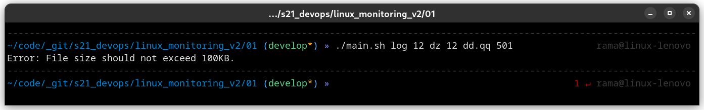

# Linux Monitoring v2.0

Мониторинг и исследование состояния системы в реальном времени.

- Для каждого задания должна быть создана папка с названием вида: `0x`, где x - номер задания
- Все скрипты должны быть декомпозированы и разбиты на несколько файлов
- Файл с основным сценарием для каждого задания должен называться `main.sh`
- Во всех скриптах должны быть предусмотрены проверки на некорректный ввод (указаны не все параметры, параметры неправильного формата и т.д.)
- Все написанные скрипты были проверены на машине с *`Manjaro Linux`*

## Содержание

1. [Linux Monitoring v2.0](#linux-monitoring-v20) \
    1.1. [Генератор файлов](#1-генератор-файлов)
2. [Task lists](#task-lists)

## 1. Генератор файлов

**== Задание ==**

Написать bash-скрипт. Скрипт запускается с 6 параметрами.
Пример запуска скрипта: `main.sh /opt/test 4 az 5 az.az 3kb`

- Параметр 1 - это абсолютный путь
- Параметр 2 - количество вложенных папок
- Параметр 3 - список букв английского алфавита, используемый в названии папок (не более 7 знаков)
- Параметр 4 - количество файлов в каждой созданной папке
- Параметр 5 - список букв английского алфавита, используемый в имени файла и расширении (не более 7 знаков для имени, не более 3 знаков для расширения)
- Параметр 6 - размер файлов (в килобайтах, но не более 100)

Имена папок и файлов должны состоять только из букв, указанных в параметрах, и использовать каждую из них хотя бы 1 раз.

Длина этой части имени должна быть от 4 знаков, плюс дата запуска скрипта в формате DDMMYY, отделённая нижним подчёркиванием, например: `./aaaz_021121/, ./aaazzzz_021121`

При этом, если для имени папок или файлов были заданы символы `az`, то в названии файлов или папок не может быть обратной записи: `./zaaa_021121/`, т.е. порядок указанных символов в параметре должен сохраняться.

При запуске скрипта в указанном в параметре 1 месте, должны быть созданы папки и файлы в них с соответствующими именами и размером.

Скрипт должен остановить работу, если в файловой системе (в разделе `/`) останется 1 Гб свободного места.

Записать лог файл с данными по всем созданным папкам и файлам (полный путь, дата создания, размер для файлов).

> `main.sh`

``` bash
#!/bin/bash

# Set the script start time
start_time=$(date +%s.%N)

function generate_name() {
    local chars="$1"
    local min_length=4
    local name=""
    
    for ((i=0; i<$min_length; i++)); do
        name="${name}${chars:$((RANDOM % ${#chars})):1}"
    done
    
    echo "${name}"
}

# Check if there is enough space to create files
function check_space() {
    local available_space=$(df --output=avail / | tail -1)
    local min_space=$((1024 * 1024))
    
    if [[ $available_space -lt $min_space ]]; then
        echo "Error: Not enough space to create files. Aborting."
        exit 1
    fi
}

# Define function to create folder and files with specified names and size
function create_folders_and_files() {
    local base_path="$1"
    local num_folders="$2"
    local folder_chars="$3"
    local num_files="$4"
    local file_chars="$5"
    local ext_chars="${file_chars:0:3}"
    local file_size_kb="$6"
    local log_file="$7"
    local date_suffix=$(date '+%d%m%y')
    
    # Create subfolders with names that include specified characters
    for ((i=0; i<$num_folders; i++)); do
        check_space
        
        local folder_name="$(generate_name "$folder_chars")_${date_suffix}"
        local folder_path="${base_path}/${folder_name}"
        mkdir -p "$folder_path"
        
        # Create files with names that include specified characters and specified size
        for ((j=0; j<$num_files; j++)); do
            check_space
            
            local file_name="$(generate_name "$file_chars")_${date_suffix}"
            local file_ext="$(generate_name "$ext_chars")"
            local file_path="${folder_path}/${file_name}.${file_ext}"
            
            truncate -s "${file_size_kb}K" "$file_path"
            echo "$(date '+%Y-%m-%d %H:%M:%S') | Created: ${file_path} | Size: ${file_size_kb}K" >> "$log_file"
        done
    done
}

function main() {
    if [[ $# -ne 6 ]]; then
        echo "Error: Arguments required."
        echo "      Usage: $0 <absolute_path> <num_folders> <folder_chars> <num_files> <file_chars> <file_size_kb>"
        exit 1
    fi
    
    # Assign input parameters to variables
    local base_path="$1"
    local num_folders="$2"
    local folder_chars="$3"
    local num_files="$4"
    local file_chars="$5"
    local file_size_kb="$6"
    
    
    if ! [[ $num_folders =~ ^[0-9]+$ ]] || ! [[ $num_files =~ ^[0-9]+$ ]] || ! [[ $file_size_kb =~ ^[0-9]+$ ]]; then
        echo "Error: One of the arguments is not a number."
        echo "      Usage: $0 <absolute_path> <num_folders> <folder_chars> <num_files> <file_chars> <file_size_kb>"
        
        exit 1
    fi
    
    if [[ $file_size_kb -gt 100 ]]; then
        echo "Error: File size should not exceed 100KB."
        exit 1
    fi
    
    local log_file="${base_path}/creation_log_$(date '+%d%m%y').txt"
    create_folders_and_files "$base_path" "$num_folders" "$folder_chars" "$num_files" "$file_chars" "$file_size_kb" "$log_file"
}

main "$@"

# Calculate script execution time
end_time=$(date +%s.%N)
elapsed_time=$(echo "$end_time - $start_time" | bc)
echo "Script execution time (in seconds) = $elapsed_time"
```

> Пример создаваемого лог файла *`creation_log_DDMMYY.txt`*

``` text
2023-04-14 03:09:02 | Created: log/zdzd_140423/dq.d_140423...dd | Size: 50K
2023-04-14 03:09:02 | Created: log/zdzd_140423/dq.q_140423.ddd. | Size: 50K
2023-04-14 03:09:02 | Created: log/zdzd_140423/..dd_140423.dd.. | Size: 50K
...
...
...
2023-04-14 03:09:02 | Created: log/dzzd_140423/.qdq_140423.ddd. | Size: 50K
2023-04-14 03:09:02 | Created: log/dzzd_140423/dqdd_140423.dd.d | Size: 50K
2023-04-14 03:09:02 | Created: log/dzzd_140423/dqqd_140423...d. | Size: 50K
```

Результаты:
1. Корректная работа

2. Размер создаваемого файла больше 100KB

3. Количество файлов или папок указано не числом

4. Отсутвуют аргументы


## Task lists

- [x] File generator
- [ ] File system clogging
- [ ] Cleaning the file system
- [ ] Log generator
- [ ] Monitoring
- [ ] GoAccess
- [ ] Prometheus and Grafana
- [ ] A ready-made dashboard
- [ ] Bonus. Your own node_exporter
