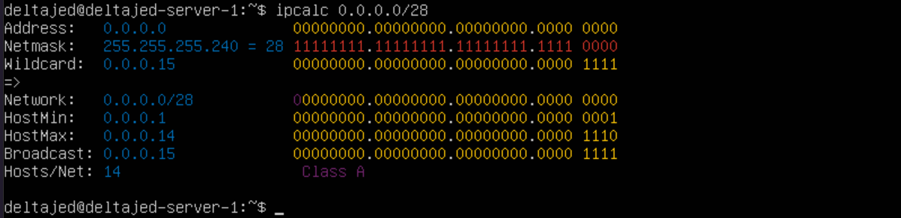
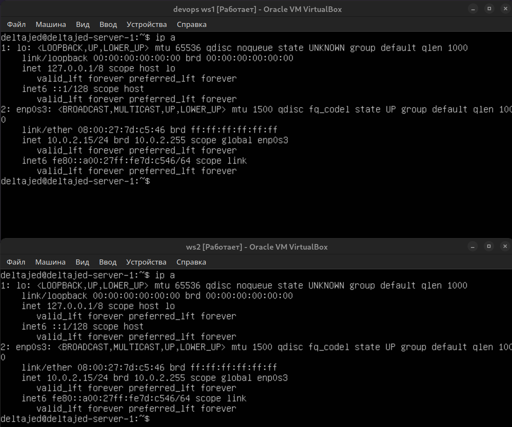
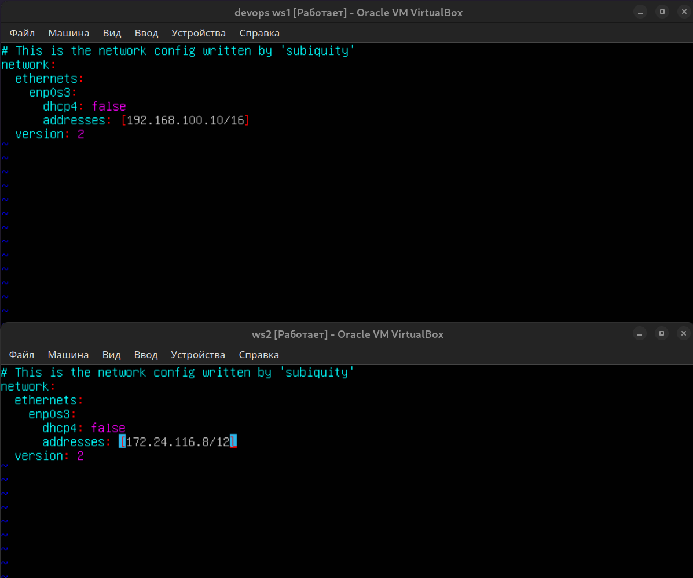
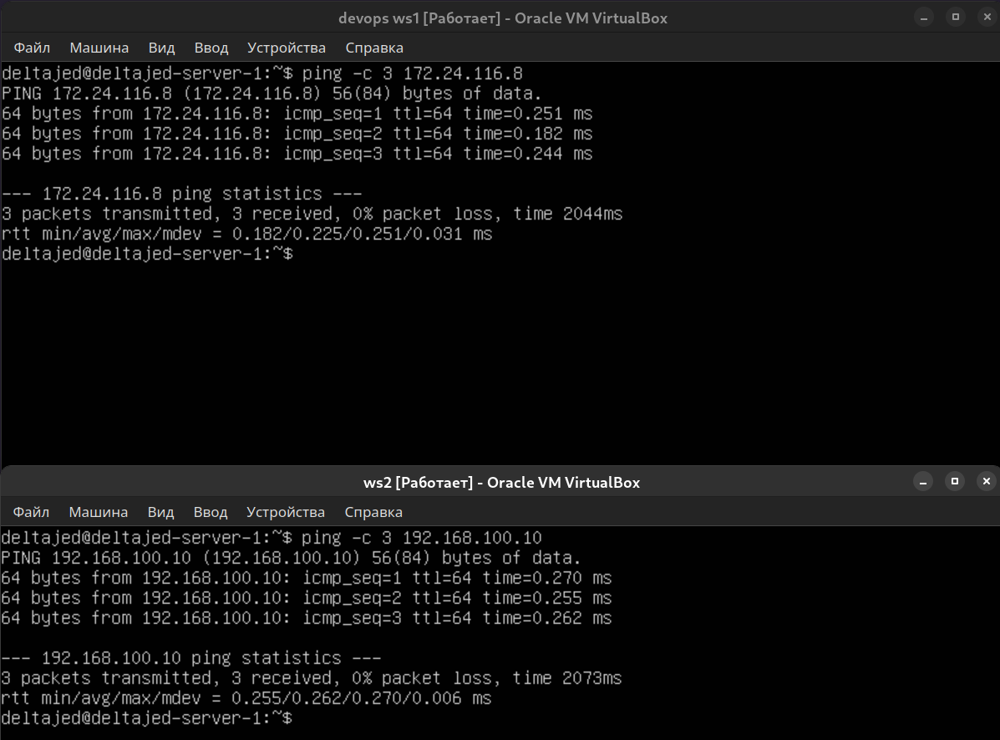
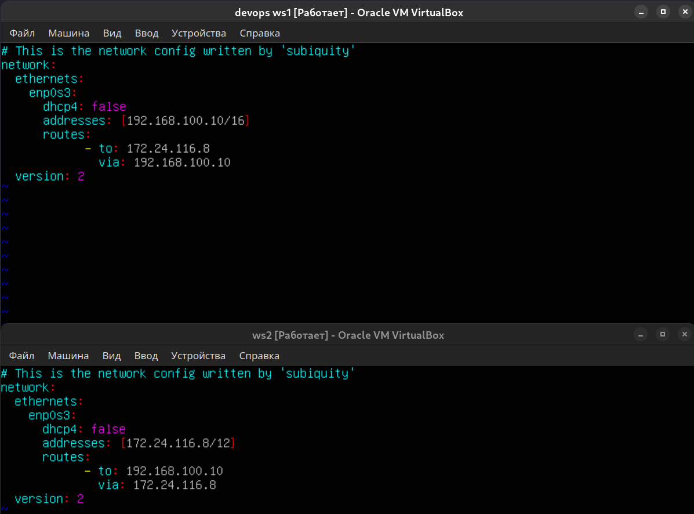
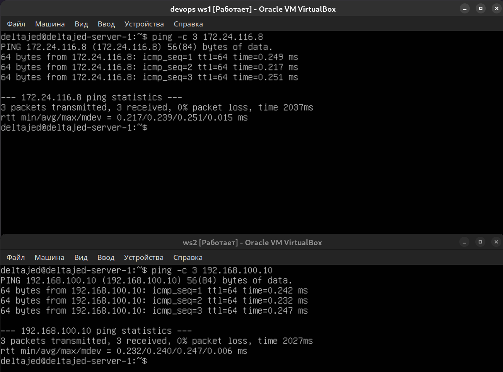

# Linux Network

1. [Инструмент ipcalc](#1-инструмент-ipcalc) \
    1.1. [Сети и маски](#11-сети-и-маски) \
    1.2. [localhost](#12-localhost) \
    1.3. [Диапазоны и сегменты сетей](#13-диапазоны-и-сегменты-сетей)
2. [Статическая маршрутизация между двумя машинами](#2-статическая-маршрутизация-между-двумя-машинами) \
    2.1. [Добавление статического маршрута вручную](#21-добавление-статического-маршрута-вручную) \
    2.2. [Добавление статического маршрута с сохранением](#22-добавление-статического-маршрута-с-сохранением)


## 1. [Инструмент ipcalc](#1-инструмент-ipcalc)

- Для начала установим сам инструмент

``` shell
$ sudo apt install ipcalc
```

### 1.1. [Сети и маски](#11-сети-и-маски)

1. Адрес сети 192.167.38.54/13

``` shell
$ ipcalc 192.167.38.54/13 | grep Network
```


2. Перевод маски 255.255.255.0 в префиксную и двоичную запись, /15 в обычную и двоичную, 11111111.11111111.11111111.11110000 в обычную и префиксную.

``` shell
$ ipcalc 255.255.255.0 | grep Netmask
```


> /15 в обычную и двоичную

``` shell
$ ipcalc 0.0.0.0/15 | grep Netmask
```


> 11111111.11111111.11111111.11110000 в обычную и префиксную

``` shell
$ ipcalc 0.0.0.0/28 | grep Netmask
```


3. Минимальный и максимальный хост в сети 12.167.38.4 при масках: /8, 11111111.11111111.00000000.00000000, 255.255.254.0 и /4

> Минимальный и максимальный хост в сети 12.167.38.4 при маске /8

``` shell
$ ipcalc 12.167.38.4/8
```


> Минимальный и максимальный хост в сети 12.167.38.4 при маске 11111111.11111111.00000000.00000000

``` shell
$ ipcalc 12.167.38.4/16
```


> Минимальный и максимальный хост в сети 12.167.38.4 при маске 255.255.254.0

``` shell
$ ipcalc 12.167.38.4/23
```


> Минимальный и максимальный хост в сети 12.167.38.4 при маске /4

``` shell
$ ipcalc 12.167.38.4/4
```


### 1.2. [localhost](#12-localhost)

1. Определить и записать в отчёт, можно ли обратиться к приложению, работающему на localhost, со следующими IP: 194.34.23.100, 127.0.0.2, 127.1.0.1, 128.0.0.1

> * Можно:      
```
127.1.0.1;    
128.0.0.1. 
```
> * Нельзя:          
```
194.34.23.100;           
128.0.0.1.
```

### 1.3. [Диапазоны и сегменты сетей](#13-диапазоны-и-сегменты-сетей)
1) Какие из перечисленных IP можно использовать в качестве публичного, а какие только в качестве частных: 10.0.0.45, 134.43.0.2, 192.168.4.2, 172.20.250.4, 172.0.2.1, 192.172.0.1, 172.68.0.2, 172.16.255.255, 10.10.10.10, 192.169.168.1

> * В качестве публичного: 
``` 
134.43.0.2; 
172.0.2.1;
192.172.0.1;
172.68.0.2;
192.169.168.1.
```
> * В качестве чаcтных: 
```
10.0.0.45;
192.168.4.2;
172.20.250.4;
172.16.255.255;
10.10.10.10.
```

2) Какие из перечисленных IP адресов шлюза возможны у сети 10.10.0.0/18: 10.0.0.1, 10.10.0.2, 10.10.10.10, 10.10.100.1, 10.10.1.255

> * Возможны: 
```
10.10.0.2;
10.10.10.10;
10.10.1.255.
```
> * Невозможны:
```
10.0.0.1;
10.10.100.1.
```


## 2. [Статическая маршрутизация между двумя машинами](#2-статическая-маршрутизация-между-двумя-машинами)

> Поднимем две виртуальные машины (далее -- `ws1` и `ws2`)
> С помощью команды `ip a` посмотрим существующие сетевые интерфейсы



``` shell
$ ifconfig -a
```

1. lo или local loopback (локальная петля). Служит для подключения по сети к этому же компьютеру и не требует дополнительной настройки;

```
* ws1: 127.0.0.1/8;
* ws2: 127.0.0.1/8.
```

2. enp0s3 - первый сетевой адаптер работающий в NAT режиме.

```
* ws1: 10.0.2.15/24;
* ws2: 10.0.2.15/24.
```

> Описать сетевой интерфейс, соответствующий внутренней сети, на обеих машинах и задать следующие адреса и маски:

```
* ws1 - 192.168.100.10, маска /16,
* ws2 - 172.24.116.8, маска /12.         
```

``` shell
$ sudo vim /etc/netplan/00-installer-config.yaml
```

> Выполнить команду netplan apply для перезапуска сервиса сети

``` shell
$ sudo netplan apply
```



### 2.1. [Добавление статического маршрута вручную](#21-добавление-статического-маршрута-вручную)

> Добавить статический маршрут от одной машины до другой и обратно при помощи команды вида `ip r add`

`ws1`
``` shell
$ sudo ip r add 172.24.116.8 dev enp0s3
```

`ws2`
``` shell
$ sudo ip r add 192.168.100.10 dev enp0s3
```

> Пропинговать соединение между машинами.

`ws1`
``` shell
$ sudo ping -c 172.24.116.8
```

`ws2`
``` shell
$ sudo ping -c 192.168.100.10
```



### 2.2. [Добавление статического маршрута с сохранением](#22-добавление-статического-маршрута-с-сохранением)

> Перезапустим машины;

``` shell
$ sudo netplan apply
```

> Добавить статический маршрут от одной машины до другой с помощью файла etc/netplan/00-installer-config.yaml

``` shell
$ sudo vim /etc/netplan/00-installer-config.yaml
```



> Пропинговать соединение между машинами

`ws1`
``` shell
$ sudo ping -c 172.24.116.8
```

`ws2`
``` shell
$ sudo ping -c 192.168.100.10
```
