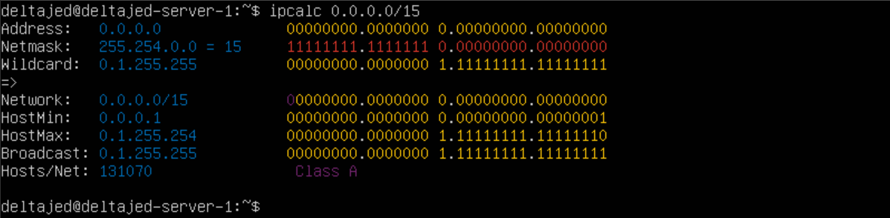

# Linux Network

1. [Инструмент ipcalc](#1-инструмент-ipcalc) \
    1.1. [Сети и маски](#11-сети-и-маски) \
    1.2. [localhost](#12-localhost) \
    1.3. [Диапазоны и сегменты сетей](#13-диапазоны-и-сегменты-сетей)


## 1. [Инструмент ipcalc](#1-инструмент-ipcalc)

- Для начала установим сам инструмент

``` shell
$ sudo apt install ipcalc
```

### 1.1. [Сети и маски](#11-сети-и-маски)

1. Адрес сети 192.167.38.54/13

``` shell
$ ipcalc 192.167.38.54/13 | grep Network
```


2. Перевод маски 255.255.255.0 в префиксную и двоичную запись, /15 в обычную и двоичную, 11111111.11111111.11111111.11110000 в обычную и префиксную.

``` shell
$ ipcalc 255.255.255.0 | grep Netmask
```


> /15 в обычную и двоичную

``` shell
$ ipcalc 0.0.0.0/15 | grep Netmask
```


> 11111111.11111111.11111111.11110000 в обычную и префиксную

``` shell
$ ipcalc 0.0.0.0/28 | grep Netmask
```


3. Минимальный и максимальный хост в сети 12.167.38.4 при масках: /8, 11111111.11111111.00000000.00000000, 255.255.254.0 и /4

> Минимальный и максимальный хост в сети 12.167.38.4 при маске /8

``` shell
$ ipcalc 12.167.38.4/8
```


> Минимальный и максимальный хост в сети 12.167.38.4 при маске 11111111.11111111.00000000.00000000

``` shell
$ ipcalc 12.167.38.4/16
```


> Минимальный и максимальный хост в сети 12.167.38.4 при маске 255.255.254.0

``` shell
$ ipcalc 12.167.38.4/23
```


> Минимальный и максимальный хост в сети 12.167.38.4 при маске /4

``` shell
$ ipcalc 12.167.38.4/4
```


### 1.2. [localhost](#12-localhost)

1. Определить и записать в отчёт, можно ли обратиться к приложению, работающему на localhost, со следующими IP: 194.34.23.100, 127.0.0.2, 127.1.0.1, 128.0.0.1

> * Можно:      
```
127.1.0.1;    
128.0.0.1. 
```
> * Нельзя:          
```
194.34.23.100;           
128.0.0.1.
```

### 1.3. [Диапазоны и сегменты сетей](#13-диапазоны-и-сегменты-сетей)