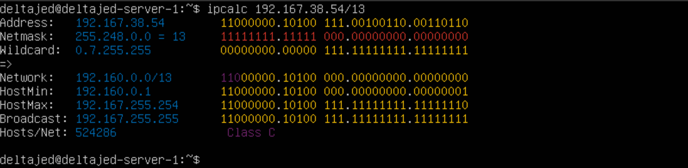
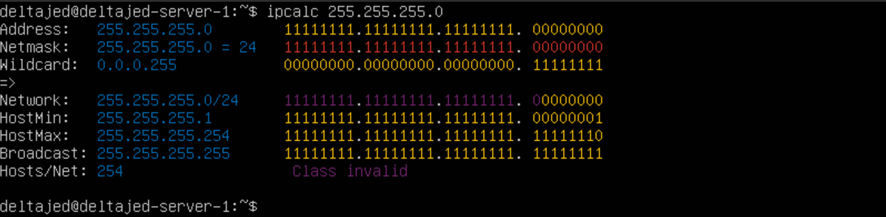

# Linux Network

1. [Инструмент ipcalc](#инструмент-ipcalc)
1.1. [Сети и маски](#сети-и-маски)


## 1. [Инструмент ipcalc](#инструмент-ipcalc)

- Для начала установим сам инструмент

``` shell
$ sudo apt install ipcalc
```

### 1.1. [Сети и маски](#сети-и-маски)

1. Адрес сети 192.167.38.54/13

``` shell
$ ipcalc 192.167.38.54/13 | grep Network
```


2. Перевод маски 255.255.255.0 в префиксную и двоичную запись, /15 в обычную и двоичную, 11111111.11111111.11111111.11110000 в обычную и префиксную.

``` shell
$ ipcalc 255.255.255.0 | grep Netmask
```


> /15 в обычную и двоичную

``` shell
$ ipcalc 0.0.0.0/15 | grep Netmask
```


> 11111111.11111111.11111111.11110000 в обычную и префиксную

``` shell
$ ipcalc 0.0.0.0/28 | grep Netmask
```


3. Минимальный и максимальный хост в сети 12.167.38.4 при масках: /8, 11111111.11111111.00000000.00000000, 255.255.254.0 и /4
